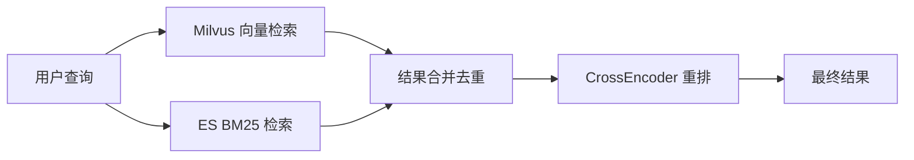
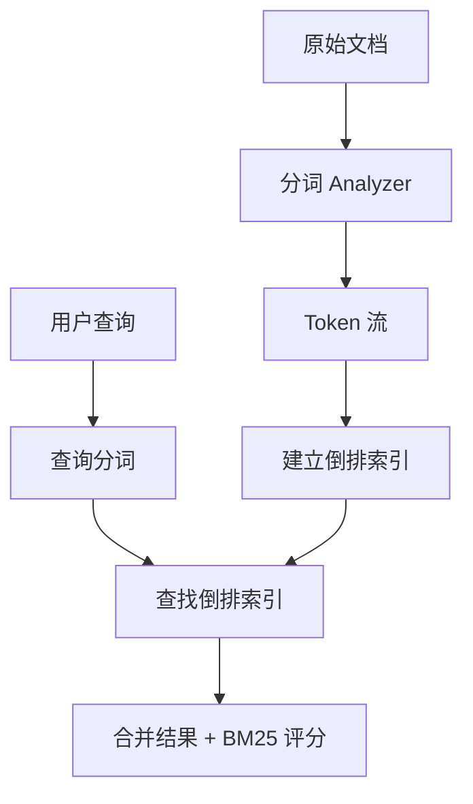
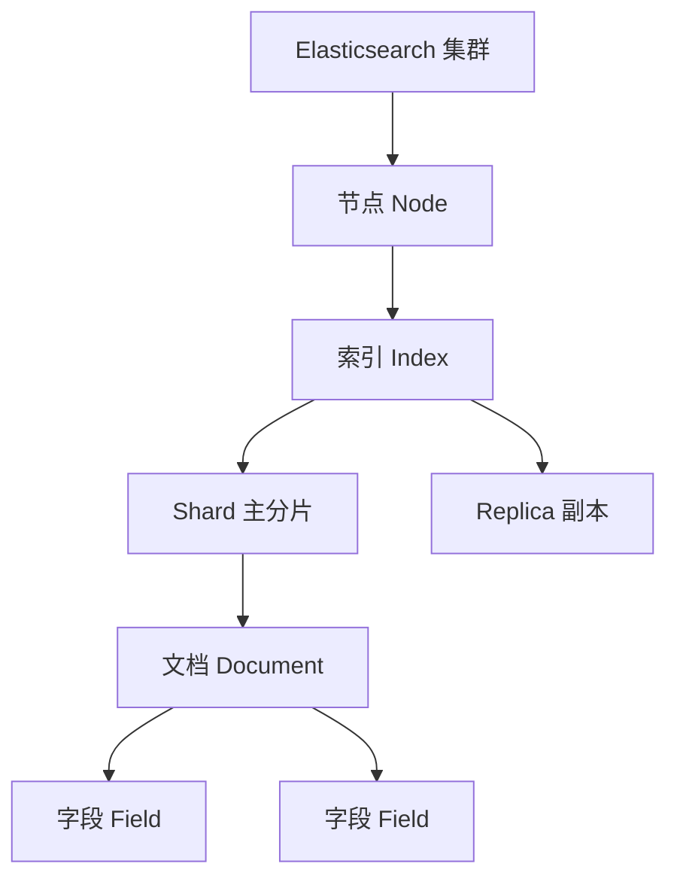
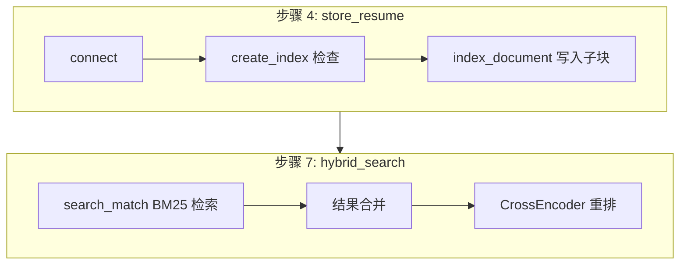

# Elasticsearch 前置知识学习模块

## 一、核心问题：SmartRecruit 为什么需要 Elasticsearch？

SmartRecruit 的检索架构采用**向量检索 + BM25 全文检索**的混合策略：

| 检索方式 | 工具 | 擅长场景 | 短板 |
|----------|------|----------|------|
| 向量检索 | Milvus | 语义相似（"后端开发" ≈ "服务端编程"） | 精确关键词可能漏召回 |
| BM25 全文检索 | Elasticsearch | 精确关键词匹配（"Java" "Spring Boot"） | 无法理解语义相似 |

**核心互补关系**：用户搜索"Java 开发经验"，Milvus 通过向量相似度能找到语义相关的简历，ES 通过 BM25 能确保包含"Java"这个关键词的简历不被遗漏。两者结果合并后进入重排阶段。

项目中对应代码（步骤 7.18）：

```python
es_results = self.es_client.search(
    index=config.ES_INDEX_NAME,
    body={"query": {"match": {"content": query}}, "size": k}
)["hits"]["hits"]
```



## 二、前置知识

### 2.1 倒排索引（Inverted Index）

倒排索引是 Elasticsearch 全文检索的核心数据结构。它的思路是：**从词到文档**，而非从文档到词。

假设有以下 3 条简历子块：

| 文档 ID | content |
|---------|---------|
| chunk_001 | 张三 Java 开发经验 |
| chunk_002 | 李四 Python 开发经验 |
| chunk_003 | 王五 Java 前端经验 |

分词后建立的倒排索引：

| 词项（Term） | 文档列表（Posting List） |
|-------------|------------------------|
| Java | [chunk_001, chunk_003] |
| Python | [chunk_002] |
| 开发 | [chunk_001, chunk_002] |
| 经验 | [chunk_001, chunk_002, chunk_003] |
| 前端 | [chunk_003] |

搜索"Java 经验"时，ES 分别找到 Java 和经验对应的文档列表，取交集（或并集），然后按 BM25 评分排序。



### 2.2 分词（Analysis）

分词是将文本拆分为词项（Token）的过程，由 **Analyzer** 完成。一个 Analyzer 包含三个部分：

1. **Char Filter**（字符过滤器）：预处理，如去除 HTML 标签
2. **Tokenizer**（分词器）：按规则拆分为 Token
3. **Token Filter**（Token 过滤器）：小写化、去停用词、词干提取等

Elasticsearch 默认使用 `standard` analyzer：
- 按 Unicode 文本边界切分
- 转小写
- 去除标点

**中文分词的特殊性**：standard analyzer 对中文按单字切分（"开发经验" → "开"、"发"、"经"、"验"），效果差。中文场景建议使用 `ik_max_word`（最细粒度）或 `ik_smart`（粗粒度）分词器。

### 2.3 BM25 评分算法

BM25（Best Match 25）是 Elasticsearch 默认的相关性评分算法。核心思想：

**一个词项对文档的相关性贡献取决于三个因素：**

1. **词频（TF）**：词在文档中出现次数越多，越相关（但有饱和曲线，不会无限增长）
2. **逆文档频率（IDF）**：词在整个索引中越罕见，越有价值（"Java"比"经验"更有区分度）
3. **文档长度归一化**：文档越长，词频的权重适当降低（避免长文档占优势）

简化公式：

```
score(D, Q) = Σ IDF(qi) × (f(qi, D) × (k1 + 1)) / (f(qi, D) + k1 × (1 - b + b × |D| / avgdl))
```

其中 `qi` 是查询中的每个词项，`f(qi, D)` 是词频，`|D|` 是文档长度，`avgdl` 是平均文档长度。

**对 SmartRecruit 的意义**：BM25 基于词项精确匹配，能精准召回包含特定技术关键词（"Kubernetes"、"微服务"）的简历，弥补向量检索可能遗漏的精确匹配场景。

### 2.4 基本概念

| 概念 | 类比 | 说明 |
|------|------|------|
| 索引（Index） | 数据库（Database） | 文档的容器，一个索引包含同类型的文档 |
| 文档（Document） | 行（Row） | JSON 格式的数据单元，每个文档有唯一 ID |
| 字段（Field） | 列（Column） | 文档中的键值对，有类型（text、keyword、object 等） |
| Mapping | Schema | 定义索引中字段的类型和索引方式 |
| Shard | 分区 | 索引的水平切分，分布在不同节点上 |
| Replica | 副本 | Shard 的复制，提供高可用和负载均衡 |



**关键字段类型**：

| 类型 | 用途 | 是否分词 |
|------|------|----------|
| `text` | 全文搜索（简历内容） | 是 |
| `keyword` | 精确匹配（ID、状态） | 否 |
| `object` | 嵌套对象（metadata） | 子字段各有类型 |
| `integer/long` | 数值类型 | 否 |

## 三、CRUD 操作详解

> 以下代码均来自 `demo.py`，每个函数可独立运行。

### 3.1 connect — 连接 ES 实例

```python
from elasticsearch import Elasticsearch

es = Elasticsearch("http://localhost:9200")
# ping() 验证连接
if es.ping():
    info = es.info()
    print(f"集群: {info['cluster_name']}, 版本: {info['version']['number']}")
```

输出示例：
```
[connect] 连接成功！集群名称: docker-cluster, 版本: 8.14.0
```

### 3.2 create_index — 创建索引

```python
mapping = {
    "mappings": {
        "properties": {
            "content": {"type": "text", "analyzer": "standard"},
            "metadata": {
                "type": "object",
                "properties": {
                    "id": {"type": "keyword"},
                    "hash": {"type": "keyword"},
                    "parent_content": {"type": "text"},
                },
            },
        }
    }
}
es.indices.create(index="prerequisite_demo_chunks", body=mapping)
```

- `content` 设为 `text` 类型，支持 match 全文搜索
- `metadata.id` 和 `metadata.hash` 设为 `keyword`，用于精确匹配
- 如果索引已存在会报错，demo 中先检查并删除

### 3.3 index_document — 索引单条文档

```python
doc = {
    "content": "张三，5年Java开发经验...",
    "metadata": {"id": "chunk_001", "hash": "abc123", "parent_content": "..."},
}
es.index(index="prerequisite_demo_chunks", id="chunk_001", document=doc)
```

- `id` 参数指定文档唯一标识，不指定则 ES 自动生成
- 如果相同 ID 的文档已存在，则覆盖（全量替换）
- **项目中的用法**（步骤 4.15）：遍历简历子块，逐条写入 ES

### 3.4 bulk_index — 批量索引

```python
from elasticsearch.helpers import bulk

docs = [
    {"_index": "idx", "_id": "1", "_source": {"content": "..."}},
    {"_index": "idx", "_id": "2", "_source": {"content": "..."}},
]
success, errors = bulk(es, docs)
```

- bulk 将多个操作合并为一次 HTTP 请求，减少网络开销
- 项目中当前使用循环逐条 `index()`，大批量场景建议改用 bulk
- `errors` 列表为空表示全部成功

### 3.5 get_document — 按 ID 获取

```python
result = es.get(index="prerequisite_demo_chunks", id="chunk_001")
print(result["_source"]["content"])  # 文档内容
print(result["_source"]["metadata"])  # 元数据
```

输出示例：
```
[get_document] 文档 ID: chunk_001
  内容: 张三，5年Java开发经验，熟悉Spring Boot、MySQL、Redis...
  元数据: {'id': 'chunk_001', 'hash': 'abc123def456', 'parent_content': '张三的完整简历内容...'}
```

### 3.6 search_match — 全文搜索

```python
body = {
    "query": {"match": {"content": "Java开发经验"}},
    "size": 5,
}
result = es.search(index="prerequisite_demo_chunks", body=body)
hits = result["hits"]["hits"]
```

- `match` 会对查询词分词后在倒排索引中查找
- 结果按 BM25 评分降序排列
- `_score` 字段即 BM25 评分
- **项目中的核心用法**（步骤 7.18）：检索与查询关键词匹配的简历子块

输出示例：
```
[search_match] 查询: "Java开发经验"，命中 2 条
  ID: chunk_001, BM25 评分: 1.2345, 内容: 张三，5年Java开发经验...
  ID: chunk_003, BM25 评分: 0.5678, 内容: 王五，8年前端开发经验...
```

### 3.7 search_bool — 组合查询

```python
body = {
    "query": {
        "bool": {
            "must": [{"match": {"content": "开发经验"}}],
            "filter": [{"prefix": {"metadata.id": "chunk_00"}}],
        }
    }
}
```

- `must`：必须匹配，参与评分（类似 SQL 的 WHERE + ORDER BY）
- `filter`：必须匹配，不参与评分（类似 SQL 的 WHERE，性能更好）
- `must_not`：必须不匹配
- `should`：至少匹配一个（boost 提升相关性）

### 3.8 update_document — 部分更新

```python
es.update(
    index="prerequisite_demo_chunks",
    id="chunk_001",
    body={"doc": {"content": "更新后的内容..."}},
)
```

- 只更新 `doc` 中指定的字段，其他字段保持不变
- 底层是"标记删除旧文档 + 索引新文档"（ES 的文档是不可变的）
- 比 `index()` 全量替换更安全（不会丢失未包含的字段）

### 3.9 delete_document — 删除文档

```python
es.delete(index="prerequisite_demo_chunks", id="chunk_004")
```

- 按 ID 删除单个文档
- 删除后再次 `get()` 会抛出 `NotFoundError`

### 3.10 delete_index — 删除索引

```python
es.indices.delete(index="prerequisite_demo_chunks")
```

- 删除整个索引及其中所有文档，**不可恢复**
- 生产环境中极少使用

## 四、与 vector_store.py 的关联

| demo 操作 | vector_store.py 中的对应位置 | 说明 |
|-----------|---------------------------|------|
| `connect()` | 步骤 2.15 | `self.es_client = Elasticsearch(config.ES_HOST)` |
| `create_index()` | 步骤 2.16 | `self.es_client.indices.create(index=config.ES_INDEX_NAME)` |
| `index_document()` | 步骤 4.15 | 循环逐条 `es_client.index(id=chunk.metadata["id"], document=es_doc)` |
| `search_match()` | 步骤 7.18 | `es_client.search(body={"query": {"match": {"content": query}}, "size": k})` |
| 结果合并 | 步骤 7.20-7.21 | Milvus 结果放入字典，ES 结果补充未命中的文档 |



## 五、常见问题

### 5.1 索引 Mapping 设计

**问题**：项目中步骤 2.16 创建索引时没有显式定义 mapping，这样有什么问题？

**解答**：ES 默认启用动态映射（dynamic mapping），首次写入文档时自动推断字段类型。大多数情况下够用，但可能导致：
- `metadata.id` 被推断为 `text` 而非 `keyword`，导致精确匹配效率低
- 数字字符串被推断为 `text`，无法做范围查询

**建议**：显式定义 mapping，至少对 `id`、`hash` 等字段指定 `keyword` 类型（demo 中已演示）。

### 5.2 分词器选择

**问题**：SmartRecruit 处理中文简历，应该用什么分词器？

**解答**：
- `standard`：默认，按单字切分中文，效果差（"开发经验" → "开"、"发"、"经"、"验"）
- `ik_max_word`：最细粒度中文分词（"开发经验" → "开发"、"经验"）——**推荐**
- `ik_smart`：粗粒度分词（"开发经验" → "开发经验"）——索引时用 ik_max_word，搜索时用 ik_smart 是常见组合

注意：项目当前未指定分词器，使用默认 standard。如果中文搜索效果不好，优先考虑换分词器。

### 5.3 bulk vs 逐条 index

**问题**：步骤 4.15 用循环逐条 `index()`，性能如何？

**解答**：逐条 index 每次都是一个 HTTP 请求。对于简历子块数量较少（通常几十到几百条）的场景，性能足够。如果子块数量达到万级以上，建议改用 `bulk` API（demo 中已演示），可以将多次请求合并为一次，显著减少网络开销。

### 5.4 中文搜索效果差怎么办？

**问题**：搜索"Java 开发"时，"开发"被单字切分，噪音很多。

**解答**：
1. 安装 IK 分词插件：`elasticsearch-plugin install analysis-ik`
2. 创建索引时指定分词器：
   ```python
   "content": {"type": "text", "analyzer": "ik_max_word", "search_analyzer": "ik_smart"}
   ```
3. 重建索引（已有数据需要 reindex）

### 5.5 ES 结果如何与 Milvus 结果合并？

**问题**：步骤 7.20-7.21 的合并逻辑是什么？

**解答**：
1. Milvus 返回 `k` 条结果，放入字典 `all_hits`（key 是文档 ID）
2. ES 也返回 `k` 条结果，遍历 ES 结果
3. 如果某个 ES 结果的 ID 不在 `all_hits` 中（Milvus 没召回），通过 MongoDB 补充元数据后加入字典
4. 最终 `all_hits` 包含两个检索源的并集，送去重排

这样确保：向量检索漏掉的精确匹配文档，通过 BM25 补回来。

## 六、运行验证

### 前提条件

1. Elasticsearch 服务已启动（`http://localhost:9200`）
2. 已安装依赖：`pip install "elasticsearch>=8.0,<9.0"`

### 运行方式

```bash
cd 2026-04-22-smartrecruit/elasticsearch
python demo.py
```

### 预期输出

脚本会按顺序执行 10 个操作，每个操作打印结果标识。关键检查点：

1. **connect**：打印集群名称和版本号（确认 ES 可连接）
2. **create_index**：打印 `acknowledged: True`
3. **index_document + bulk_index**：打印成功写入的文档数
4. **get_document**：打印文档内容和元数据
5. **search_match**：打印命中条数和 BM25 评分
6. **search_bool**：打印组合查询的命中条数
7. **update_document**：打印更新后内容，确认变更生效
8. **delete_document**：打印确认删除，验证文档不存在
9. **delete_index**：打印索引已删除（清理 demo 数据）

如果任何步骤报错 `ConnectionError`，请先确认 ES 服务已启动：`curl http://localhost:9200`。

### 幂等性

脚本是幂等的：每次运行会先删除旧索引再重新创建，不会产生重复数据或冲突。运行结束后自动清理索引，不污染项目数据。
