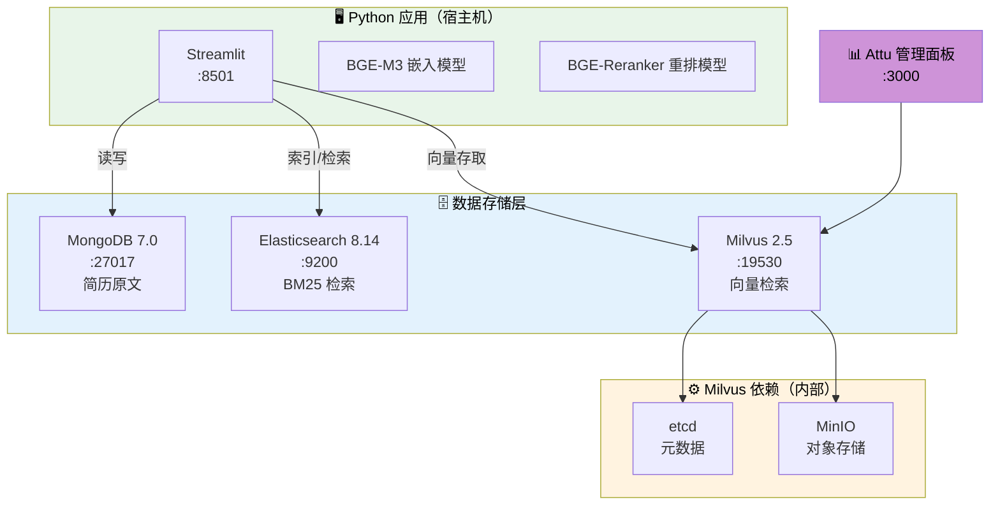

# 00 — Docker 部署方案

> 本文档提供 SmartRecruit 项目的完整本地部署指南。
> 部署文件位于项目根目录 `deployment/` 下。

---

## 一、环境需求

| 组件 | 最低版本 | 说明 |
|---|---|---|
| Docker | 20.10+ | 容器运行环境 |
| Docker Compose | v2.0+ | 编排多个容器 |
| Python | 3.10+ | 应用运行环境（推荐 3.10） |
| 磁盘空间 | ≥10GB | 模型文件 + 数据 |
| 内存 | ≥8GB | BGE-M3 模型加载约 2GB |

> **关于 MySQL**：项目 config.py 中声明了 MySQL 配置，但经复查确认**没有任何代码实际引用或连接 MySQL**。部署方案中不包含 MySQL，config.py 中保留配置备用即可。

---

## 二、架构总览



**Milvus 为什么需要 etcd 和 MinIO？**

- **etcd**：Milvus 的元数据存储（记录有哪些 Collection、索引信息等）
- **MinIO**：Milvus 的对象存储（存储向量数据的底层文件）

**Attu**：Milvus 官方 Web 管理面板，启动后访问 `http://localhost:3000`，填写 Milvus 地址 `localhost:19530` 即可连接。支持查看 Collection、Schema、数据量、向量维度，以及向量搜索测试。

---

## 三、国内镜像加速

国内访问 Docker Hub、Elastic、Quay 等镜像源较慢，需要配置镜像加速。

### 3.1 配置 Docker daemon（必须）

编辑 Docker 配置文件，添加 `registry-mirrors`：

**macOS**：Docker Desktop → Settings → Docker Engine
**Windows**：Docker Desktop → Settings → Docker Engine
**Linux**：`/etc/docker/daemon.json`

```json
{
  "builder": {
    "gc": {
      "defaultKeepStorage": "20GB",
      "enabled": true
    }
  },
  "experimental": false,
  "registry-mirrors": [
    "https://docker.1ms.run",
    "https://docker.1panelproxy.com",
    "https://2a6bf1988cb6428c877f723ec7530dbc.mirror.swr.myhuaweicloud.com",
    "https://docker.m.daocloud.io",
    "https://hub-mirror.c.163.com",
    "https://mirror.baidubce.com",
    "https://dockerhub.icu",
    "https://docker.registry.cyou",
    "https://mirror.aliyuncs.com",
    "https://dockerproxy.com",
    "https://docker.nju.edu.cn",
    "https://docker.mirrors.sjtug.sjtu.edu.cn",
    "https://docker.mirrors.ustc.edu.cn",
    "https://mirror.iscas.ac.cn",
    "https://docker.rainbond.cc"
  ]
}
```

保存后**重启 Docker**。

> ⚠️ `registry-mirrors` 只对 Docker Hub 镜像生效。`docker.elastic.co`（Elasticsearch）和 `quay.io`（etcd）属于第三方 registry，不走 mirrors 加速。如果这两个拉取超时，手动执行：
> ```bash
> docker pull quay.io/coreos/etcd:v3.5.16
> docker pull docker.elastic.co/elasticsearch/elasticsearch:8.14.0
> ```
> 多试几次，或开代理后重试。拉取成功后后续 `docker compose up` 会直接使用本地缓存。

---

## 四、部署文件说明

部署文件位于项目根目录 `deployment/docker-compose.yml`，包含以下服务：

| 服务 | 镜像 | 端口 | 说明 |
|---|---|---|---|
| MongoDB | `mongo:7.0` | 27017 | 文档存储，存完整简历 |
| Elasticsearch | `docker.elastic.co/elasticsearch/elasticsearch:8.14.0` | 9200 | 全文检索，BM25 关键词匹配 |
| etcd | `quay.io/coreos/etcd:v3.5.16` | — | Milvus 元数据存储（内部服务） |
| MinIO | `minio/minio:RELEASE.2024-09-22T00-33-43Z` | 9000 / 9001 | Milvus 对象存储（9001 为 Console） |
| Milvus | `milvusdb/milvus:v2.5.4` | 19530 | 向量数据库，支持混合检索 |
| Attu | `zilliz/attu:v2.4` | 3000 | Milvus Web 管理面板 |

**版本选择理由**：

| 服务 | 版本 | 原因 |
|---|---|---|
| MongoDB 7.0 | 当前稳定版 | 官方多架构支持（arm64 + amd64） |
| Elasticsearch 8.14.0 | 明确版本号 | 避免 8.x 大版本 breaking change |
| etcd v3.5.16 | Milvus 2.5 官方推荐 | 兼容性有保障 |
| MinIO 2024-09-22 | 稳定版 | 轻量 S3 兼容存储 |
| Milvus v2.5.4 | 与 pymilvus 2.5.x 匹配 | 确保客户端和服务端版本一致 |
| Attu v2.4 | 与 Milvus 2.5 兼容 | 官方可视化管理工具 |

> **兼容性说明**：以上所有镜像均支持 `linux/arm64`（Mac Apple Silicon）和 `linux/amd64`（Intel Mac / Linux 服务器）。

---

## 五、部署步骤

### 5.1 启动中间件

```bash
cd deployment
docker compose up -d

# 查看启动状态（等待所有服务变为 healthy）
docker compose ps

# 查看日志（如有问题）
docker compose logs -f
```

等待所有服务 healthy（约 30-60 秒）。

### 5.2 验证服务

```bash
# MongoDB
docker exec smartrecruit-mongodb mongosh -u admin -p 123456 --eval "db.runCommand({ping:1})"

# Elasticsearch（注意 URL 需加引号，否则 zsh 会把 ? 当作通配符）
curl "http://localhost:9200/_cluster/health?pretty"

# Milvus（需先安装 pymilvus，见 5.3 节）
python3 -c "
from pymilvus import MilvusClient
c = MilvusClient(uri='http://localhost:19530')
print('Milvus OK:', c.list_collections())
"

# Attu 管理面板
# 浏览器访问 http://localhost:3000，Milvus 地址填 localhost:19530
```

> 💡 Milvus 验证需要 `pymilvus` 已安装。如果还没配置 Python 环境，可以跳过这步，等 5.3 节装好依赖后再验证。

### 5.3 Python 环境配置

#### 方式一：venv（推荐，轻量）

```bash
cd /path/to/2026-04-22-smartrecruit

# 创建虚拟环境
python3 -m venv .venv
source .venv/bin/activate

# 安装依赖
pip install -r requirements.txt
```

#### 方式二：Conda

```bash
cd /path/to/2026-04-22-smartrecruit

# 创建环境（Python 3.10 推荐）
conda create -n smartrecruit python=3.10 -y
conda activate smartrecruit

# 安装依赖
pip install -r requirements.txt
```

> 💡 **为什么推荐 3.10？**：本项目依赖的 LangChain 0.3、pymilvus 2.5 等库在 Python 3.10 上兼容性最好。3.9 部分库版本受限，3.12+ 部分库尚未完全适配。

### 5.4 配置 API Key

`config.py` 中 `DASHSCOPE_API_KEY` 已改为通过 `os.getenv()` 读取，需要设置环境变量。两种方式：

**方式一：.env 文件（推荐）**

项目代码使用了 `python-dotenv`，会自动加载 `.env` 文件。在项目根目录创建：

```env
DASHSCOPE_API_KEY=sk-your-actual-api-key
```

**方式二：手动设置环境变量**

```bash
# macOS / Linux
export DASHSCOPE_API_KEY=sk-your-actual-api-key

# Windows (PowerShell)
$env:DASHSCOPE_API_KEY = "sk-your-actual-api-key"

# Windows (CMD)
set DASHSCOPE_API_KEY=sk-your-actual-api-key
```

> ⚠️ 方式二设置的环境变量仅在当前终端窗口有效，关闭后失效。推荐用 .env 文件。

### 5.5 初始化简历数据

等代码编写完成后运行：

```bash
# 确保在虚拟环境中
conda activate smartrecruit  # 或 source .venv/bin/activate

# 初始化（扫描 data/resume/ 目录下的简历并入库）
python system_data_init.py
```

### 5.6 启动应用

代码编写完成后运行

```bash
streamlit run app.py
```

浏览器访问 `http://localhost:8501`

---

## 六、可视化管理面板

`docker compose up -d` 启动后，以下管理面板可直接在浏览器访问：

| 面板 | 访问地址 | 账号密码 | 用途 |
|---|---|---|---|
| **Attu**（Milvus） | http://localhost:3000 | 无需登录 | 查看 Collection、Schema、数据量、向量搜索测试 |
| **Mongo Express**（MongoDB） | http://localhost:9081 | admin / 123456 | 浏览数据库、集合、文档，执行查询 |
| **Kibana**（Elasticsearch） | http://localhost:5601 | 无需登录 | 查看索引、文档，Dev Tools 执行搜索查询 |

### Kibana 常用操作（索引名：`resume_chunks`）

打开 Kibana 后，进入左侧 **Dev Tools**（开发工具），执行以下命令：

**查看索引信息**

```json
GET /resume_chunks
```

**查看索引文档数量**

```json
GET /resume_chunks/_count
```

**查询所有文档**（默认返回前10条）

```json
GET /resume_chunks/_search
{
  "query": {
    "match_all": {}
  }
}
```

**关键词搜索**（如搜索包含"Python"的简历片段）

```json
GET /resume_chunks/_search
{
  "query": {
    "match": {
      "content": "Python"
    }
  }
}
```

**删除索引**（⚠️ 会丢失所有数据）

```json
DELETE /resume_chunks
```
| **MinIO Console** | http://localhost:9001 | minioadmin / minioadmin | Milvus 底层对象存储，一般不需要直接操作 |

> 💡 **Attu** 连接时需填写 Milvus 地址 `localhost:19530`。**Kibana** 首次打开可能需要几秒钟初始化。

### 快速验证面板是否正常

```bash
# Attu
curl -s -o /dev/null -w "%{http_code}" http://localhost:3000
# 期望：200

# Mongo Express
curl -s -o /dev/null -w "%{http_code}" http://localhost:9081
# 期望：200

# Kibana
curl -s -o /dev/null -w "%{http_code}" http://localhost:5601/api/status
# 期望：200
```

---

## 七、常用操作

```bash
# 停止所有服务
docker compose down

# 停止并清除数据（慎用！会删除 Milvus/ES/MongoDB 所有数据）
docker compose down -v

# 查看某个服务的日志
docker compose logs milvus
docker compose logs elasticsearch

# 重启某个服务
docker compose restart milvus

# 只启动/停止某个服务
docker compose up -d attu
docker compose stop attu
```

---

## 七、故障排查

| 问题 | 可能原因 | 解决方案 |
|---|---|---|
| 镜像拉取超时 | 国内网络慢 | 配置 daemon.json registry-mirrors（见第三节） |
| etcd/ES 拉取失败 | quay.io / elastic.co 不走 mirrors | 手动 `docker pull`，多试或开代理 |
| Milvus 启动失败 | etcd/minio 未就绪 | 等 healthcheck 通过，或 `docker compose restart milvus` |
| ES 启动失败 | 内存不足 | 调小 `ES_JAVA_OPTS`（默认 512m），或增加 Docker 内存限制 |
| MongoDB 连接失败 | 认证配置不匹配 | 检查 config.py 中的用户名密码与 docker-compose 一致 |
| BGE-M3 加载失败 | 模型文件不存在 | 确保 `models/bge-m3/` 目录下有完整的模型文件 |
| PyMilvus 版本冲突 | pymilvus 与 Milvus 服务版本不匹配 | 确保都是 2.5.x |

---

→ 下一篇：[01-document-processor — 文档处理](../01-document-processor/)
