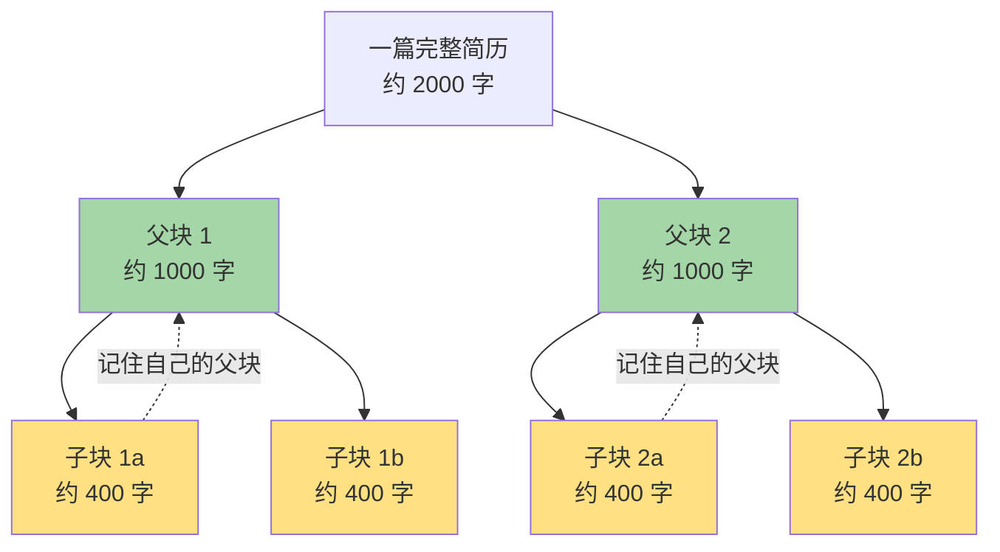
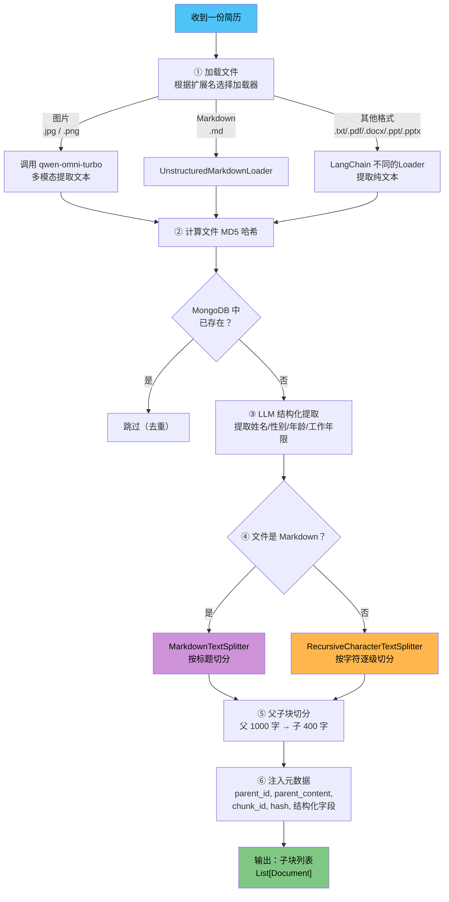

# 01 — 文档处理模块

> **对应源文件**：`utils/document_processor.py`
> **在架构中的位置**：数据层的入口，所有简历在进入数据库之前都要经过这里。

---

## 一、核心问题

> 如何把各种格式的简历（PDF、Word、TXT、Markdown、PPT、甚至图片）变成系统能检索的标准化数据块？

这就是文档处理模块要解决的问题。它是一条**流水线**，简历进来，经过四道工序，变成一块块带着元数据的"卡片"，存入数据库。

核心处理流程如下：


---

## 二、前置知识

### 2.1 什么是文档加载器（Document Loader）？

**类比**：你收到一封用日语写的信，一封用英语写的，还有一封用中文写的。你需要一个翻译官把每封信都翻译成你能理解的语言。

文档加载器就是"翻译官"——PDF、Word、TXT、Markdown、图片，每种格式有自己的"语言"，加载器负责把它们统一翻译成**纯文本**。

本项目支持的格式：

| 格式 | 加载方式 | 底层库 |
|---|---|---|
| `.txt` | TextLoader（自动尝试 utf-8、gbk、latin1 编码） | LangChain |
| `.pdf` | PyPDFLoader | PyPDF |
| `.docx` | Docx2txtLoader | docx2txt |
| `.md` | UnstructuredMarkdownLoader | unstructured |
| `.ppt` / `.pptx` | UnstructuredPowerPointLoader | unstructured |
| `.jpg` / `.png` | **不使用传统加载器**，调用 qwen-omni-turbo 视觉模型提取 | DashScope API |

**注意**：图片简历没有用传统的 OCR（如 Tesseract），而是直接用多模态大模型提取。这样做的好处是理解能力更强——不仅能识别文字，还能理解布局（比如"这段是工作经历，那段是教育背景"）。

### 2.2 什么是文本切分（Text Splitting）？

**类比**：一本 500 页的《红楼梦》，如果你要找"林黛玉进贾府"的情节，你会从头翻到尾吗？不会。你会用书的目录，直接翻到那一章。

但如果这书没有目录呢？那就需要有人帮你**按章节拆开，做成一张张摘要卡片**。文本切分就是干这个的——把一整篇长文档切成一个个**大小合适的文本片段**，每个片段包含足够的上下文信息。

### 2.3 什么是"父子块"策略？

这是本项目的**核心设计**之一，理解它对理解整个检索流程至关重要。

**类比**：图书馆里有两套索引系统：

- **子块 = 索引卡片**（每张卡片上只有几句话，方便快速浏览和精确匹配）
- **父块 = 完整的资料页**（包含完整的上下文信息，方便深度阅读）



**为什么不直接用大块？** 大块（1000字）包含的信息多，但搜索时匹配不够精准。比如用户搜"Python"，一个大块里可能混着 Python 经验和教育背景，语义信号被稀释了。

**为什么不直接用小块？** 小块（400字）搜索精准，但展示给 LLM 时上下文不够——用户问"这个人做过什么项目？"，一个 400 字的片段可能只包含项目的一小部分。

**所以两全其美**：用子块去搜索（精准），命中后返回对应的父块给 LLM（完整上下文）。

### 2.4 Markdown 切分 vs 通用切分

| 切分器 | 适用场景 | 切分依据 |
|---|---|---|
| `RecursiveCharacterTextSplitter` | PDF、TXT、DOCX、PPT | 按`\n\n` → `\n` → ` ` → `""`逐级切分 |
| `MarkdownTextSplitter` | Markdown 文件 | 按 Markdown 标题（`#`、`##`、`###`）切分 |

Markdown 文件天然有结构化标题，按标题切分能保持语义完整性——每个块刚好是一个完整的章节。而普通文本没有这种结构，只能按字符数机械切分。

本项目的处理逻辑是：**根据文件扩展名自动选择切分器**。

---

## 三、函数调用关系

整个模块由 **5 个函数**组成，按依赖关系从底层到顶层：

```
process_document()          ← 最上层：父子块切分（接收 Document 对象）
    ↑
load_and_hash_document()    ← 中间层：加载文件 + 计算 MD5（接收文件路径）
    ├── compute_file_hash()     ← 底层工具：计算文件 MD5
    └── extract_text_from_image() ← 底层工具：图片文字提取（仅图片简历使用）
    
parse_resume_structure()    ← 独立：LLM 结构化提取（接收纯文本）
```

下面的讲解按这个依赖顺序展开：先看底层工具函数，再看组合函数，最后看核心切分逻辑。

---

## 四、处理流程（完整版）



---

## 五、核心函数解析

### 5.0 前置准备：配置与导入

首先是文件头部的导入和配置部分：

```python
# utils/document_processor.py — 文件头部

import os
import re
import hashlib
import json
import base64
from typing import List, Dict, Any
from datetime import datetime

# LangChain 组件
from langchain_community.document_loaders import (
    TextLoader,
    UnstructuredMarkdownLoader,
    PyPDFLoader,
    Docx2txtLoader,
    UnstructuredPowerPointLoader,
)
from langchain_core.documents import Document
from langchain_text_splitters import (
    RecursiveCharacterTextSplitter,
    MarkdownTextSplitter,
)

# OpenAI 兼容客户端（本项目使用阿里云 DashScope）
from openai import OpenAI
from loguru import logger

# 项目配置
from config import config

# --- 日志配置 ---
logger.add(
    os.path.join(config.LOG_DIR, "document_processor.log"),
    rotation="10 MB",
    encoding="utf-8",
)

# --- LLM 客户端初始化 ---
# 使用阿里云 DashScope 的 OpenAI 兼容接口
parser_client = OpenAI(
    api_key=config.DASHSCOPE_API_KEY,
    base_url="https://dashscope.aliyuncs.com/compatible-mode/v1",
)
```

**讲解要点**：
- 所有加载器来自 `langchain_community`，切分器来自 `langchain_text_splitters`，Document 模型来自 `langchain_core`——注意这三个包的层级区别
- DashScope 提供了 OpenAI 兼容接口，所以可以直接用 `openai` 库的客户端，只需改 `base_url`
- 日志使用 `loguru` 而非标准 `logging`，API 更简洁

---

### 5.1 计算文件哈希（`compute_file_hash`）

```python
def compute_file_hash(file_path: str) -> str:
    """
    计算文件的 MD5 哈希值，用于简历去重。

    原理：同一份文件（内容完全相同）的 MD5 值一定相同，
    不同文件的 MD5 值几乎一定不同（碰撞概率极低）。
    因此可以用 MD5 来判断"这份简历我们是不是已经处理过了"。

    Args:
        file_path: 文件路径

    Returns:
        32位十六进制 MD5 字符串，例如 "d41d8cd98f00b204e9800998ecf8427e"

    Raises:
        FileNotFoundError: 文件不存在时抛出
    """
    hasher = hashlib.md5()
    try:
        # 以二进制模式读取，避免编码问题
        with open(file_path, "rb") as f:
            # 每次读 4KB，避免大文件一次性占满内存
            for chunk in iter(lambda: f.read(4096), b""):
                hasher.update(chunk)
        return hasher.hexdigest()
    except Exception as e:
        logger.error(f"计算文件hash失败: {file_path}, 错误: {str(e)}")
        raise
```

**讲解要点**：
- `iter(lambda: f.read(4096), b"")` 是 Python 惯用法：每次读 4KB，读到空字节 `b""` 时自动停止
- 为什么不直接 `hasher.update(f.read())`？大文件（比如大 PDF）会一次性吃掉大量内存
- 返回值是 32 位十六进制字符串，例如 `"5d41402abc4b2a76b9719d911017c592"`

---

### 5.2 图片文字提取（`extract_text_from_image`）

接下来看多模态调用——这是 `load_and_hash_document` 内部处理图片时会调用的函数。

```python
def extract_text_from_image(image_path: str, client: OpenAI) -> str:
    """
    使用多模态大模型从图片中提取简历文本。

    本项目使用阿里云 qwen-omni-turbo 模型，它是一个视觉语言模型（VLM），
    能够理解图片中的文字和布局。

    与传统 OCR（如 Tesseract）的区别：
    - OCR 只能识别文字，不理解语义
    - VLM 不仅能识别文字，还能理解布局（如"这段是工作经历"）

    Args:
        image_path: 图片文件路径（.jpg / .png）
        client: OpenAI 兼容客户端（已配置 DashScope base_url）

    Returns:
        提取的纯文本字符串

    Raises:
        FileNotFoundError: 图片文件不存在
        Exception: API 调用失败
    """
    # 1. 将图片转为 base64 编码
    #    OpenAI Vision API 要求图片以 base64 格式嵌入请求
    with open(image_path, "rb") as img_file:
        img_base64 = base64.b64encode(img_file.read()).decode("utf-8")

    # 2. 构造多模态请求
    #    消息体是一个列表，包含文本和图片两种类型的 content
    response = client.chat.completions.create(
        model="qwen-omni-turbo",
        messages=[
            {
                "role": "user",
                "content": [
                    {
                        "type": "image_url",
                        "image_url": {
                            "url": f"data:image/jpeg;base64,{img_base64}"
                        },
                    },
                    {
                        "type": "text",
                        "text": "提取图片中的简历文本信息，包括个人信息、教育背景、工作经历等。输出纯文本。",
                    },
                ],
            }
        ],
        stream=False,  # 不使用流式输出，直接返回完整结果
    )

    content = response.choices[0].message.content
    logger.info(f"图片提取文本成功: {image_path}, 内容长度: {len(content)}")
    return content
```

**讲解要点**：
- base64 编码的图片嵌入到请求体中，而不是作为外部 URL 引用——这样不需要图片在公网上可访问

- `content` 字段是一个**列表**，可以混合文本和图片——这就是多模态消息的标准格式，🉑参考阿里云百炼API参考对OpenAI 格式接入千问模型的说明文档：

  https://bailian.console.aliyun.com/cn-beijing?spm=5176.12818093_47.resourceCenter.1.700816d0fB1ihT&tab=api#/api/?type=model&url=3016807

- `stream=False` 表示等待完整响应，适合离线批处理场景

---

### 5.3 加载文件 + 计算哈希（`load_and_hash_document`）

`load_and_hash_document` 是前面两个函数的组合——格式路由 + 加载器选择 + 编码兼容 + MD5 去重。

首先定义格式路由表：

```python
# --- 文件格式 → 加载器映射表 ---
# None 表示不使用 LangChain Loader，走特殊处理（图片用 VLM）
document_loaders = {
    ".txt": TextLoader,
    ".pdf": PyPDFLoader,
    ".docx": Docx2txtLoader,
    ".ppt": UnstructuredPowerPointLoader,
    ".pptx": UnstructuredPowerPointLoader,
    ".jpg": None,   # 图片：使用 extract_text_from_image()
    ".png": None,
    ".md": UnstructuredMarkdownLoader,
}
```

然后写加载函数：

```python
def load_and_hash_document(file_path: str, client: OpenAI) -> tuple[str, str]:
    """
    加载文件内容并计算 MD5 哈希。

    根据文件扩展名自动选择对应的加载器：
    - 图片（.jpg/.png）：调用 qwen-omni-turbo 多模态提取
    - .txt：尝试 utf-8 → gbk → latin1 三种编码（兼容 Windows GBK 文件）
    - 其他格式：使用对应的 LangChain Loader

    Args:
        file_path: 文件路径
        client: OpenAI 兼容客户端（图片提取时需要）

    Returns:
        (content, doc_hash) 元组
        - content: 提取的纯文本
        - doc_hash: 文件 MD5 哈希（32位十六进制）

    Raises:
        ValueError: 不支持的文件格式
        UnicodeDecodeError: txt 文件所有编码都失败
        Exception: 加载过程中的其他错误
    """
    logger.info(f"开始加载并哈希文件: {file_path}")
    file_extension = os.path.splitext(file_path)[1].lower()

    # 1. 检查格式是否支持
    if file_extension not in document_loaders:
        raise ValueError(f"不支持的文件类型: {file_extension}")

    content = ""

    try:
        # 2. 图片走多模态提取
        if file_extension in [".jpg", ".png"]:
            content = extract_text_from_image(file_path, client)
        else:
            loader_class = document_loaders[file_extension]

            # 3. TXT 文件需要尝试多种编码（兼容中文环境）
            if file_extension == ".txt":
                encodings = ["utf-8", "gbk", "latin1"]
                for enc in encodings:
                    try:
                        loader = loader_class(file_path, encoding=enc)
                        content = loader.load()[0].page_content
                        break  # 成功就用这个编码
                    except UnicodeDecodeError:
                        continue  # 当前编码失败，试下一个
                else:
                    # 所有编码都失败
                    raise UnicodeDecodeError(
                        f"无法以支持的编码加载文件: {file_path}",
                        b"", 0, 0, "尝试所有编码失败"
                    )
            else:
                # 4. 其他格式直接加载
                loader = loader_class(file_path)
                content = loader.load()[0].page_content

        # 5. 计算文件 MD5
        doc_hash = compute_file_hash(file_path)
        logger.info(f"文件加载并哈希成功: {file_path}, hash: {doc_hash}")
        return content, doc_hash

    except Exception as e:
        logger.error(f"加载或哈希文件失败: {file_path}, 错误: {str(e)}")
        raise
```

**讲解要点**：
- **格式路由表**是一种常见设计模式——新增格式只需在字典里加一行，不用改函数逻辑
- **for-else 语法**：Python 的 for 循环可以跟 else——如果循环正常结束（没被 break），就执行 else 块。这里用于检测"所有编码都失败了"
- **LangChain Loader 统一接口**：不管什么格式，`loader.load()` 都返回 `List[Document]`，取 `[0].page_content` 就是纯文本

---

### 5.4 LLM 结构化提取（`parse_resume_structure`）

文件加载出来后，下一步是让 LLM 提取简历中的结构化字段。这个函数不依赖文件加载，只接收纯文本。

**为什么需要结构化提取？**

用户搜简历时，不只会做语义查询（如"会 Python 的后端工程师"），还会用**精确条件过滤**——"只要男性"、"年龄 30 岁以下"、"3 年以上工作经验"。

纯向量检索做不到这件事。向量相似度反映的是"内容相关性"，不是"属性匹配"——两个性别不同、年龄不同但经历相似的人，向量相似度几乎一样，无法按性别或年龄筛选。

所以系统设计了**双层检索**：

1. **向量检索**（语义匹配）→ 找到内容相关的简历块
2. **元数据过滤**（精确匹配）→ 在检索结果上按 `gender`、`age`、`work_experience` 等字段精确筛选

`parse_resume_structure` 提取的四个字段（`name`、`gender`、`age`、`work_experience`）就是第二层的过滤依据。它们作为元数据随子块一起存入 Milvus，检索时就可以在 query 里加 `filter: "age < 30 and work_experience >= 3"` 这样的条件，实现语义+属性的联合检索，实现精准匹配。

```python
# --- 简历结构化信息提取的 Prompt 模板 ---
RESUME_PARSER_PROMPT = """
你是一个顶级的HR简历分析专家。请从以下简历文本中，提取出关键的结构化信息。

**严格遵守以下规则:**
1.  **提取字段**: 只提取以下字段：`name` (姓名), `gender` (性别), `age` (年龄), `work_experience` (工作年限)。
2.  **JSON格式**: 必须严格按照JSON格式输出，不要有任何额外的解释或Markdown标记。
3.  **逻辑推断**:
    - **姓名 (name)**: 通常是文本开头最明显的人名。
    - **性别 (gender)**: 从文本中明确的"男"或"女"字样判断。如果未提及，则为 "未提供"。
    - **年龄 (age)**: 根据出生年份、或直接描述的年龄计算。例如"1990年出生"在2024年应计算为34岁。如果无法推断，则为 -1。
    - **工作年限 (work_experience)**: 根据工作经历的总时长计算。例如"2020年7月至2023年7月"是3年。如果无法推断，则为 -1。
4.  **数值类型**: `age` 和 `work_experience` 必须是整数。

**简历文本:**
---
{resume_text}
---

**输出JSON:**
"""


def parse_resume_structure(resume_text: str, client: OpenAI) -> Dict[str, Any]:
    """
    使用 LLM 从简历纯文本中提取结构化信息。

    为什么不用正则/规则解析？
    - 简历格式千变万化："男，30岁" vs "Gender: Male, 1994" vs 只写毕业年份不写年龄
    - 规则永远覆盖不全，LLM 能"理解"语义并灵活推断

    提取的字段会作为元数据存入向量数据库（Milvus），
    用于检索时的精确过滤（如"只要男性""年龄≤35""5年以上经验"）。

    Args:
        resume_text: 简历纯文本
        client: OpenAI 兼容客户端

    Returns:
        dict，包含 name/gender/age/work_experience 四个字段
        解析失败时返回默认值 {"name": "未知", "gender": "未提供", "age": -1, "work_experience": -1}
    """
    logger.info("开始使用LLM解析简历结构化信息...")
    try:
        response = client.chat.completions.create(
            model="qwen-plus",
            messages=[
                {"role": "system", "content": "你是一个顶级的HR简历分析专家。"},
                {"role": "user", "content": RESUME_PARSER_PROMPT.format(resume_text=resume_text)},
            ],
            temperature=0.0,  # 温度设为 0，保证输出稳定可复现
        )
        content = response.choices[0].message.content
        logger.debug(f"LLM原始解析结果: {content}")

        # 清理 LLM 输出：去掉可能的 ```json ``` 包裹
        json_str = content.strip().removeprefix("```json").removesuffix("```").strip()
        structured_data = json.loads(json_str)

        # 数据清洗：确保类型正确
        structured_data['age'] = int(structured_data.get('age', -1))
        structured_data['work_experience'] = int(structured_data.get('work_experience', -1))
        structured_data['gender'] = structured_data.get('gender', '未提供')

        logger.info(f"简历结构化信息解析成功: {structured_data}")
        return structured_data

    except Exception as e:
        logger.error(f"解析简历结构化信息失败: {e}", exc_info=True)
        # 优雅降级：返回默认值，不中断整个处理流程
        return {"name": "未知", "gender": "未提供", "age": -1, "work_experience": -1}
```

**讲解要点**：
- `temperature=0.0`：结构化提取不需要"创意"，要的是稳定一致的输出
- `.removeprefix("```json").removesuffix("```")`：LLM 有时会在 JSON 前后加 markdown 代码块标记，需要清理
- **优雅降级**：解析失败返回默认值而不是抛异常——一份简历提取失败不应该阻断整批处理

---

### 5.5 父子块切分（`process_document`）

最后是整个模块的核心——父子块切分，将一个 Document 对象切成带完整元数据的子块列表。

```python
def process_document(doc: Document) -> List[Document]:
    """
    对单个文档进行父子块切分。

    切分策略：
    1. 先用父切分器切成大块（1000 字符）
    2. 再对每个父块用子切分器切成小块（400 字符）
    3. 每个子块携带父块的 ID 和完整内容（用于检索后返回上下文）

    切分器选择：
    - .md 文件使用 MarkdownTextSplitter（按标题切分，保持语义完整）
    - 其他格式使用 RecursiveCharacterTextSplitter（按字符逐级切分）

    Args:
        doc: LangChain Document 对象，必须包含 metadata['hash'] 和 metadata['file_path']

    Returns:
        List[Document]：子块列表，每个子块的 metadata 包含：
        - chunk_id: 子块唯一标识（格式：doc_{hash}_parent_{j}_child_{k}）
        - parent_id: 父块 ID
        - parent_content: 父块完整文本（检索命中后直接返回给 LLM，无需二次查询）
        - hash: 文件 MD5
        - file_path: 文件路径
        以及其他从原始 doc 继承的 metadata
    """
    logger.info(f"开始处理单个文档: {doc.metadata.get('file_path', 'N/A')}")

    # --- 初始化切分器 ---
    # 从 config 中读取参数，方便统一调整
    parent_splitter = RecursiveCharacterTextSplitter(
        chunk_size=config.PARENT_CHUNK_SIZE,  # 1000
        chunk_overlap=config.CHUNK_OVERLAP,   # 100
    )
    child_splitter = RecursiveCharacterTextSplitter(
        chunk_size=config.CHILD_CHUNK_SIZE,   # 400
        chunk_overlap=config.CHUNK_OVERLAP,   # 100
    )
    markdown_parent_splitter = MarkdownTextSplitter(
        chunk_size=config.PARENT_CHUNK_SIZE,
        chunk_overlap=config.CHUNK_OVERLAP,
    )
    markdown_child_splitter = MarkdownTextSplitter(
        chunk_size=config.CHILD_CHUNK_SIZE,
        chunk_overlap=config.CHUNK_OVERLAP,
    )

    # --- 根据文件类型选择切分器 ---
    file_extension = os.path.splitext(doc.metadata.get("file_path", ""))[1].lower()
    is_markdown = file_extension == ".md"
    parent_splitter_to_use = markdown_parent_splitter if is_markdown else parent_splitter
    child_splitter_to_use = markdown_child_splitter if is_markdown else child_splitter
    logger.info(
        f"使用切分器: {'Markdown' if is_markdown else 'RecursiveCharacter'}"
    )

    # --- 第一步：切成父块 ---
    parent_docs = parent_splitter_to_use.split_documents([doc])
    logger.debug(f"切分为 {len(parent_docs)} 个父块")

    # --- 第二步：对每个父块切成子块，并注入元数据 ---
    child_chunks = []
    for j, parent_doc in enumerate(parent_docs):
        # 生成父块 ID
        parent_id = f"doc_{doc.metadata['hash']}_parent_{j}"

        # 给父块也加上标识（父块本身不入库）;这里也可不加
        #parent_doc.metadata["chunk_id"] = parent_id
        #parent_doc.metadata["page_content"] = parent_doc.page_content
        #parent_doc.metadata.update(doc.metadata) # 继承原始文档的 metadata

        # 将父块切成子块
        sub_chunks = child_splitter_to_use.split_documents([parent_doc])
        for k, sub_chunk in enumerate(sub_chunks):
            # 生成子块 ID
            chunk_id = f"{parent_id}_child_{k}"

            # 注入元数据
            sub_chunk.metadata["parent_id"] = parent_id
            sub_chunk.metadata["parent_content"] = parent_doc.page_content
            sub_chunk.metadata["chunk_id"] = chunk_id
            sub_chunk.metadata["id"] = chunk_id  # 兼容字段
            sub_chunk.metadata.update(doc.metadata)  # 继承原始文档的 metadata
            child_chunks.append(sub_chunk)
            logger.debug(
                f"生成子块: {chunk_id}, 父块: {parent_id}, "
                f"内容长度: {len(sub_chunk.page_content)}"
            )

    logger.info(f"文档 {doc.metadata['file_path']} 共生成 {len(child_chunks)} 个子块")
    return child_chunks
```

**讲解要点**：
- 切分器参数从 `config` 读取而非硬编码——修改 `config.py` 就能全局调整，不用改业务代码
- `parent_content` 被复制到每个子块的 metadata 中——空间换时间，检索命中后直接返回父块内容，无需再查数据库
- ID 命名规则 `doc_{hash}_parent_{j}_child_{k}`：全局唯一，可反向追溯到源文件

---

## 六、切分参数解读

| 参数 | 配置项 | 值 | 含义 |
|---|---|---|---|
| `PARENT_CHUNK_SIZE` | `config.PARENT_CHUNK_SIZE` | 1000 | 父块最大 1000 字符 |
| `CHILD_CHUNK_SIZE` | `config.CHILD_CHUNK_SIZE` | 400 | 子块最大 400 字符 |
| `CHUNK_OVERLAP` | `config.CHUNK_OVERLAP` | 100 | 块之间重叠 100 字符 |

**为什么是这些值？**

- **400 字子块**：大约 3-5 句话，足够表达一个完整的信息点（比如一段工作经历），又不会太长导致搜索信号被稀释
- **1000 字父块**：大约 8-10 句话，足够覆盖一个主题的完整上下文
- **100 字重叠**：防止"张三毕业于北京大学"这句话，前半句在块A，后半句在块B

---

## 七、模块接口总结

| 函数 | 输入 | 输出 | 用途 |
|---|---|---|---|
| `compute_file_hash` | 文件路径 | MD5 字符串 | 去重判断 |
| `extract_text_from_image` | 图片路径 + client | 纯文本 | 图片简历提取 |
| `load_and_hash_document` | 文件路径 + client | `(纯文本, MD5)` | 加载 + 去重 |
| `parse_resume_structure` | 纯文本 + client | `{name, gender, age, work_experience}` | 结构化提取 |
| `process_document` | Document 对象 | `List[Document]`（子块列表） | 父子块切分 |

---

## 八、运行验证

源文件 `utils/document_processor.py` 底部自带了完整的验证代码，覆盖了整个流水线的三个环节。以下是源码中的验证逻辑：

```python
if __name__ == "__main__":
    """验证文档加载、解析和切分功能"""
    logger.info("="*50)
    logger.info("开始独立验证 document_processor.py 模块...")
    
    # 选择一个测试文件
    test_dir = config.LOCAL_RESUME_DIR
    test_file_name = "李明AI大模型产品经理简历.pdf"  # 可换成任意存在的文件名
    test_file_path = os.path.join(test_dir, test_file_name)
    
    if not os.path.exists(test_file_path):
        logger.error(f"测试文件不存在，请确保 '{test_file_path}' 存在后再运行验证。")
    else:
        try:
            # 1. 验证加载和哈希
            logger.info(f"--- 1. 测试加载与哈希 ---")
            content, doc_hash = load_and_hash_document(test_file_path, parser_client)
            assert content and doc_hash
            logger.info(f"加载成功: hash={doc_hash}, 内容长度={len(content)}")

            # 2. 验证结构化解析
            logger.info(f"--- 2. 测试结构化信息解析 ---")
            structured_data = parse_resume_structure(content, parser_client)
            assert isinstance(structured_data, dict) and "name" in structured_data
            logger.info(f"解析成功: {structured_data}")

            # 3. 验证切块
            logger.info(f"--- 3. 测试文档切块 ---")
            doc = Document(page_content=content, metadata={"file_path": test_file_path, "hash": doc_hash})
            chunks = process_document(doc)
            assert chunks and isinstance(chunks, list)
            logger.info(f"切块成功: 共生成 {len(chunks)} 个子块。")
            logger.info(f"第一个子块内容: {chunks[0].page_content}")
            logger.info(f"第一个子块元数据: {chunks[0].metadata}")

            logger.success("document_processor.py 模块所有功能验证通过！")
            print("\n[SUCCESS] document_processor.py module validation passed!")

        except Exception as e:
            logger.critical(f"document_processor.py 模块验证失败: {e}", exc_info=True)
            print(f"\n[FAILURE] document_processor.py module validation failed.")
```

**验证逻辑说明**：

| 步骤 | 验证内容 | 断言 |
|---|---|---|
| 1 | 加载 PDF 文件 + 计算 MD5 | `content` 非空且 `doc_hash` 有值 |
| 2 | LLM 提取姓名/性别/年龄/工作年限 | 返回 dict 且包含 `name` 字段 |
| 3 | 父子块切分 | 返回非空 list，每个子块带完整元数据 |

**运行方式**：

```bash
cd /path/to/smartrecruit
python utils/document_processor.py
```

**前置条件**：

- `.env` 中配置了 `DASHSCOPE_API_KEY`
- `data/resume/` 目录下有 `李明AI大模型产品经理简历.pdf`（或修改源码中的 `test_file_name`）

---

→ 下一篇：[02-vector-store — 向量存储与检索](../02-vector-store/)
