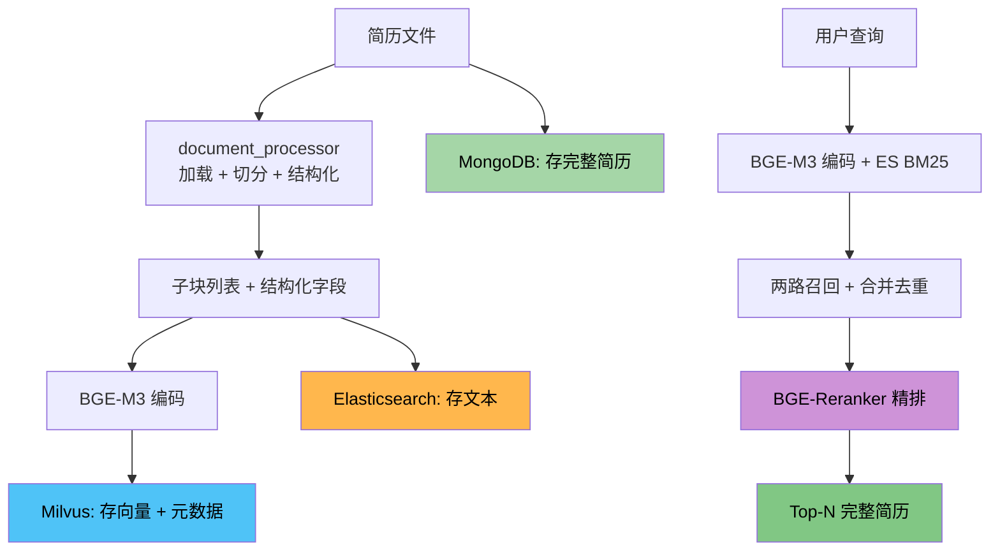
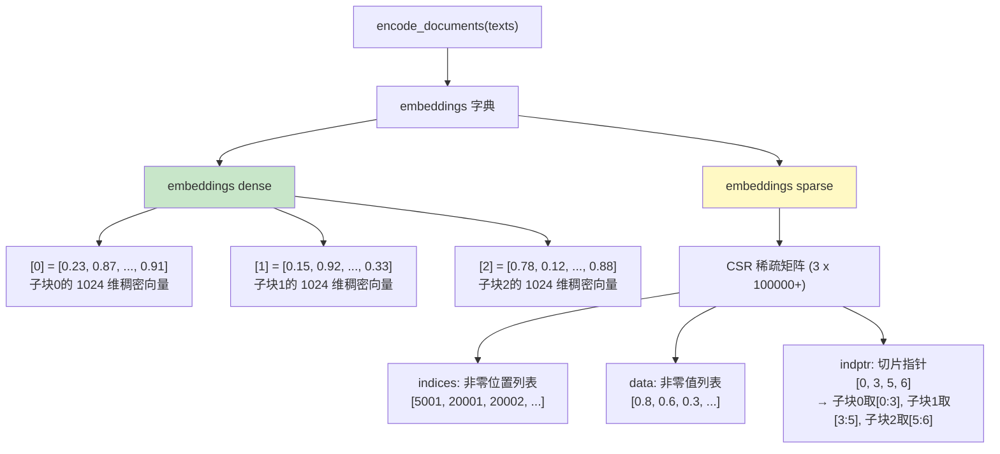
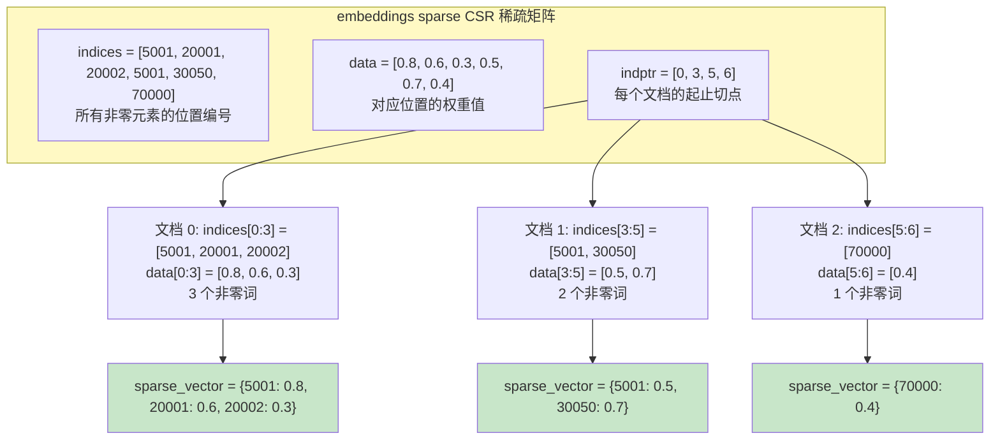
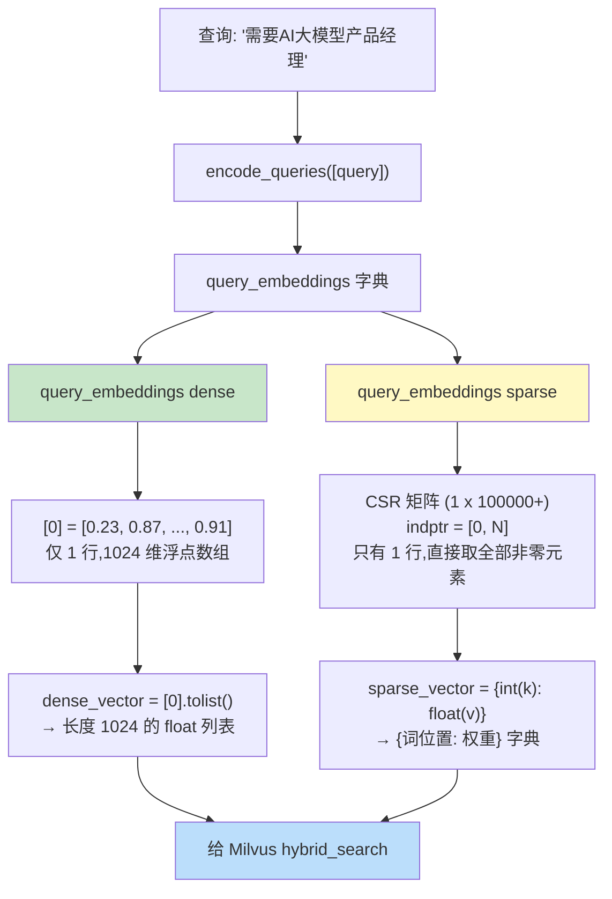
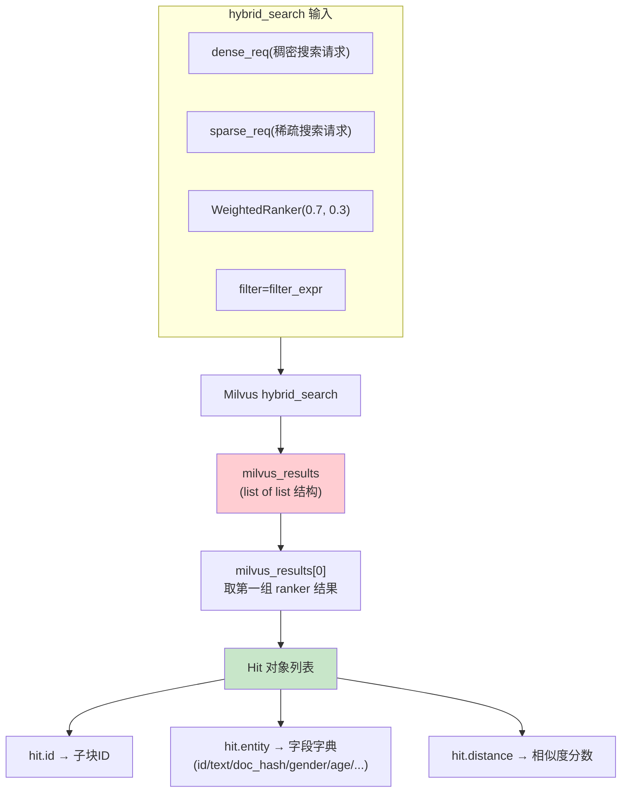
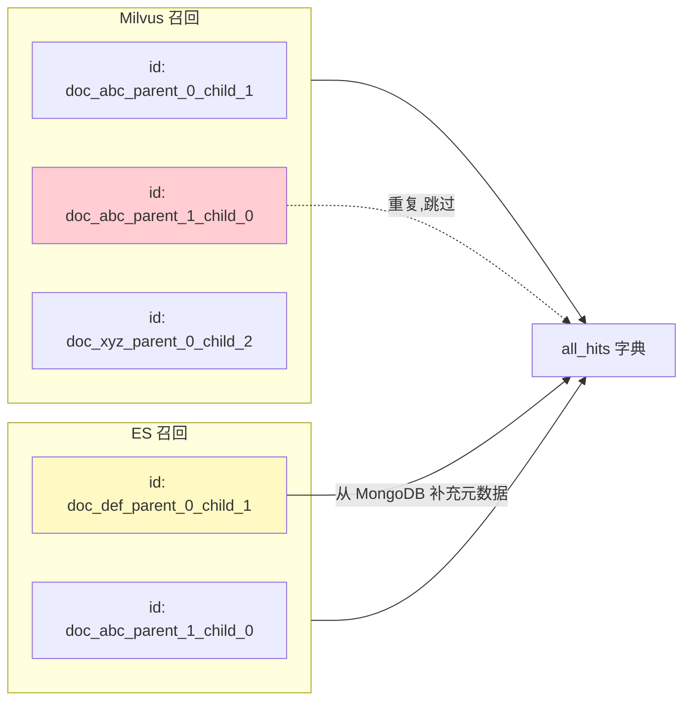
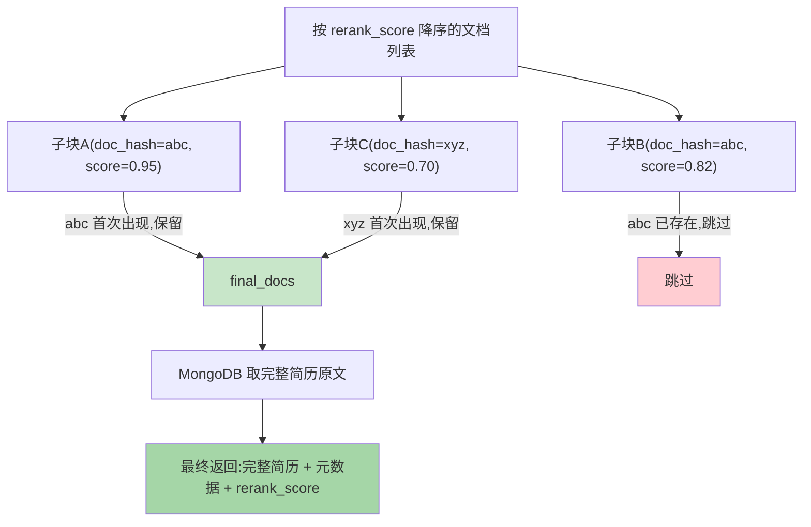

# 02 - 向量存储与检索模块

> **对应源文件**:`utils/vector_store.py`
> **在架构中的位置**:数据层的核心,管理所有简历数据的存储和检索。

---

## 一、核心问题

> 简历存到哪里?用户输入"需要AI产品经理"时,怎么从上万份简历中找到最匹配的?

如果只用一个数据库,你会面临一个两难选择:
- 用关系型数据库(MySQL)--精确匹配行,但"AI产品经理"和"大模型方向PM"是两条完全不同的记录,匹配不到
- 用向量数据库(Milvus)--语义匹配强,但"必须会Python"这种硬性要求无法精确过滤

本模块的解决方案是:**三个数据库各司其职,两路召回加精排**。

**存储层**:简历写入时同时存入三个数据库：

* Milvus 存向量(负责语义搜索),

* Elasticsearch 存文本(负责关键词搜索),

* MongoDB 存完整简历(负责查看详情和去重判断)。

**检索层**:用户搜索时,Milvus 和 ES 各自独立召回一批结果,合并去重后用 Reranker 模型精排,最终按 doc_hash 去重返回完整简历。



---

## 二、前置知识

> **深入学习**：向量的概念、稠密/稀疏向量对比、向量数据库原理、IVF_FLAT 索引、IP 距离、CSR 格式等技术细节，已整理为独立的前置知识模块，详见 [`milvus/README.md`](../../milvus/README.md) 第二章（2.1-2.8）。

> **简要速查**：稠密向量 = 语义指纹（理解"意思"），稀疏向量 = 词汇签到表（精确匹配"词"），向量数据库（Milvus）= 按语义距离搜索。详细解释和图解见上方链接。


---

### 2.1 模型下载与本地部署

> ⚠️ **动手前必看**：本讲后续所有验证代码都需要这两个模型，请先完成下载。

项目使用的两个模型均为 **预训练权重文件**，存放在 `models/` 目录下。**不需要部署 Ollama 等模型服务**，Python 代码直接加载本地权重到内存中运行。

**自动下载（推荐）**：

```bash
# 在项目根目录执行，直接从 HuggingFace 下载
cd 2026-04-22-smartrecruit
python utils/model_download.py
```

如果无法访问 HuggingFace，设置镜像后再执行同一命令：

```bash
# macOS / Linux
export HF_ENDPOINT=https://hf-mirror.com
python utils/model_download.py
```

```cmd
:: Windows CMD
set HF_ENDPOINT=https://hf-mirror.com
python utils/model_download.py
```

```powershell
# Windows PowerShell
$env:HF_ENDPOINT = "https://hf-mirror.com"
python utils/model_download.py
```

该脚本会自动下载以下两个模型到 `models/` 目录：

| 模型 | HuggingFace 地址 | 存放路径 |
|---|---|---|
| BGE-M3 | BAAI/bge-m3 | `models/bge-m3/` |
| BGE-Reranker-Base | BAAI/bge-reranker-base | `models/bge-reranker-base/` |

> 💡 如果目标目录已存在且非空，脚本会自动跳过，支持断点续传。

**手动下载**（网络受限时）：浏览器访问镜像站，逐个下载文件到对应目录：

| 模型 | 下载地址 | 存放路径 |
|---|---|---|
| BGE-M3 | https://hf-mirror.com/BAAI/bge-m3/tree/main | `models/bge-m3/` |
| BGE-Reranker-Base | https://hf-mirror.com/BAAI/bge-reranker-base/tree/main | `models/bge-reranker-base/` |

> 每个模型文件较多，建议下载页面右上角的 ZIP 包，解压后重命名文件夹放到 `models/` 对应路径下。

#### 加载方式

两个模型都在 `VectorStore.__init__()` 中加载，整个应用生命周期只加载一次，之后常驻内存。

**BGE-M3（嵌入模型）** — 通过 `milvus_model.hybrid.BGEM3EmbeddingFunction` 加载。

`milvus_model` 是 Milvus 官方提供的 Python 包（`pip install milvus-model` 时自动安装），`BGEM3EmbeddingFunction` 是其中封装好的类。它的作用是：给定一段中文文本，把它转换成**两组数字**（向量）：

- **稠密向量**：1024 个浮点数，捕捉文本的语义含义。例如"AI产品经理"和"算法负责人"在向量空间中距离较近，因为含义相似
- **稀疏向量**：类似关键词匹配的数字化表示，捕捉精确词汇。例如"Java"只会匹配"Java"，不会匹配"Python"

加载时只需指定本地模型路径，它会自动读取 `pytorch_model.bin`（权重文件）和 `config.json`（模型结构配置），整个过程不需要联网。**一个模型同时产出两种向量**，省去维护两个嵌入模型的麻烦。

**BGE-Reranker-Base（重排模型）** — 通过 `sentence_transformers.CrossEncoder` 加载。

`sentence_transformers` 是一个专门用于文本向量处理的 Python 库（`pip install sentence-transformers` 安装），`CrossEncoder` 是其中的一个类。和嵌入模型不同——嵌入模型是单独处理一段文本，而 CrossEncoder 是**同时看查询和文档两个文本**，给出一个 0~1 的相关性分数。

举例：查询是"需要5年经验的Python开发"，文档A是"3年Python后端"，文档B是"5年Python全栈开发"，CrossEncoder 会打分：文档B ≈ 0.85，文档A ≈ 0.42，然后按分数排序。

**两者的区别总结：**

| | BGE-M3（嵌入模型） | BGE-Reranker（重排模型） |
|---|---|---|
| 输入 | 一段文本 | 两个文本（查询 + 文档） |
| 输出 | 向量（数字数组） | 相关性分数（0~1） |
| 用途 | 把文本变成向量，存入 Milvus 或用于检索 | 召回后的精排，按相关性打分 |
| 类比 | 给每份简历贴上"特征标签" | HR同时看需求和简历，打匹配分 |

#### CPU / GPU 切换

当前代码默认使用 CPU（`vector_store.py` 第 40 行 `device='cpu'`）。如有 GPU 可修改：

| 硬件 | 修改方式 |
|---|---|
| NVIDIA 显卡 | `device='cpu'` → `device='cuda'` |
| Mac Apple Silicon | `device='cpu'` → `device='mps'` |

> 对于简历推荐场景（非高并发），CPU 推理已足够，查询响应约 1-2 秒。

---

### 2.2 什么是重排序（Reranking）？

**类比**：招聘流程中的两轮筛选：

1. **初试(检索/Recall)**:HR 快速浏览 100 份简历,选出 20 份看起来相关的 → 追求**速度**和**覆盖率**
2. **复试(精排/Rerank)**:技术主管仔细阅读这 20 份简历,重新评估并排名 → 追求**准确性**

本项目用 **BGE-Reranker**(一个 CrossEncoder 模型)做复试。初试用的模型是"双塔"结构--query 和 document 分别编码,速度快但精度有限。复试用的 CrossEncoder 把 query 和 document **拼在一起**输入模型,能捕捉更细粒度的语义关联,更准但更慢。

### 2.3 为什么需要三个数据库？

| 数据库 | 存什么 | 解决什么问题 |
|---|---|---|
| **Milvus** | 子块的向量 + 结构化字段 | 语义搜索 + 元数据过滤(性别/年龄/经验) |
| **Elasticsearch** | 子块的文本内容 | 关键词精确匹配(BM25) |
| **MongoDB** | 完整简历原文 + 结构化数据 | 查看简历详情、去重判断 |

Milvus 擅长向量搜索但全文搜索弱,ES 擅长全文搜索但不存向量,MongoDB 适合存结构化文档但不做搜索。三者各有所长,组合使用才能覆盖所有检索需求。

**一个常见的疑问:Milvus 的稀疏向量不就能做关键词检索了吗,为什么还需要 ES?**

确实,Milvus 的稀疏向量(BGE-M3 生成)能捕捉词级别的重要性,在一定程度上替代关键词检索。但和 ES 的 BM25 相比有两个关键差异:

**打个比方**:同样是找一本"Python 编程"的书：

- **ES BM25**:图书管理员翻卡片目录,找到"Python"这个词精确出现在书名或摘要里的所有书。**字面完全一致才算命中**。Elasticsearch的倒排索引，是在**真正的词项（term）**级别进行精确命中。在处理产品型号、订单编号、唯一标识符这类数据时，它的精确性是至关重要的。

- **Milvus 稀疏向量**:签到簿不按完整词建页,而是按"子词碎片"建页——"Python"被拆成"Py"和"thon"两个碎片,各占一页。匹配逻辑本身是**精确的**（碎片页签到了才算匹配）,但因为粒度是碎片而不是完整词,所以"Python"和"PyTorch"会在"Py"这页上重叠——这就是为什么它能捕获词根相似,但也可能引入噪音。

  BGE-M3的稀疏向量是**子词级精确匹配**。这对于搜索`iPhone 15`可能没问题，但一旦搜索`iPhone 15 Pro Max 256G 蓝色`这样的具体型号，问题就来了。

  因为`iPhone 15`和`iPhone 15 Pro Max`共享 `'Pro'`、`'Max'` 等子词碎片，如果后者权重足够高，它就会和前者一起被召回。这对语义泛化是好事，但在精确匹配场景下就成了“噪音”。

| 对比维度 | Milvus 稀疏向量 | ES BM25 |
|---|---|---|
| **词粒度** | 子词(subword)碎片,不是完整词 | 完整词级别,按分词器切分 |
| **匹配逻辑** | 精确匹配子词碎片(不是模糊匹配),但碎片≠完整词,所以"Py"可能同时匹配"Python"和"PyTorch" | 精确匹配完整词--分词结果必须包含查询词 |
| **优点** | "AI产品经理"和"大模型PM"的子词碎片可能有重叠,能匹配 | 绝对精准,搜 "Python" 只返回包含 "Python" 的文档 |
| **盲区** | "Python"和"PyTorch"碎片重叠导致噪音;原文包含"Python"但碎片权重低的文档可能漏掉 | 无法理解同义词和近义词 |

所以 ES 补充了 Milvus 稀疏向量覆盖不到的**精确关键词匹配**场景,两者互补而非重复。

### 2.4 补充概念

> IVF_FLAT 索引、IP 距离、CSR 格式的详细技术解释，见 [`milvus/README.md`](../../milvus/README.md) 2.6-2.8。

---

## 三、方法调用关系

`VectorStore` 是一个类,包含 7 个方法,按调用关系从底层到顶层:

```
__init__()
    └── _initialize_components()
            └── _create_or_load_collection()

store_resume()                    ← 写入:存储简历(独立方法)
get_metadata_by_hash()            ← 读取:按 hash 查元数据(被 hybrid_search 调用)
get_full_resume()                 ← 读取:按 hash 查完整简历(被 hybrid_search 调用)

hybrid_search_with_rerank()       ← 核心:混合检索 + 重排(调用上面两个 get 方法)
    └── aget_relevant_documents() ← 异步包装(直接调用 hybrid_search)
```

下面的讲解按这个顺序展开:先看初始化和存储,再看检索。

---

## 四、处理流程(完整版)

```mermaid
flowchart TD
    subgraph 检索["检索流程"]
        R1["用户查询 + 过滤参数<br/>(gender/age/experience)"]
        R1 --> R2["BGE-M3 编码查询"]
        R2 --> R3["Milvus 混合检索<br/>稠密 0.7 + 稀疏 0.3<br/>+ 元数据过滤"]
        R1 --> R4["ES 关键词检索<br/>BM25"]
        R3 --> R5{"按 id 合并去重"}
        R4 --> R5
        R5 --> R6["BGE-Reranker 精排"]
        R6 --> R7["按 rerank_score 降序"]
        R7 --> R8{"按 doc_hash 去重<br/>同一份简历只保留1份"}
        R8 --> R9["MongoDB 获取完整简历原文"]
        R9 --> R10["返回 Top-N 完整简历"]
    end
    
    subgraph 写入["写入流程"]
        W1["接收 Document + chunks + structured_data"]
        W1 --> W2{"MongoDB 中<br/>已存在该 hash?"}
        W2 -->|"是"| WSkip["跳过(去重)"]
        W2 -->|"否"| W3["BGE-M3 批量编码<br/>生成稠密+稀疏向量"]
        W3 --> W4["插入 Milvus<br/>向量 + 元数据"]
        W4 --> W5["索引到 Elasticsearch<br/>文本 + metadata"]
        W5 --> W6["存入 MongoDB<br/>完整简历 + 结构化数据"]
    end

    style WSkip fill:#FFCDD2
    style W6 fill:#A5D6A7
    style R3 fill:#4FC3F7,color:#000
    style R6 fill:#CE93D8,color:#000
    style R10 fill:#81C784,color:#000
```



---

## 五、核心方法解析

本节按代码执行顺序逐个解析 6 个方法,每个方法包含完整代码 + 逐行注释 + 运行验证。

**方法索引**:

| 编号 | 方法 | 作用 |
|---|---|---|
| 1 | `__init__` + `_initialize_components` | 构造函数,初始化 Milvus/MongoDB/ES/BGE-M3/Reranker 五个组件 |
| 2 | `_create_or_load_collection` | 创建或加载 Milvus 集合(含 schema + 索引) |
| 3 | `store_resume` | 将简历写入三个数据库(Milvus + ES + MongoDB) |
| 4 | `get_metadata_by_hash` / `get_full_resume` | 按 hash 查询 MongoDB 中的元数据或完整简历 |
| 5 | `hybrid_search_with_rerank` | 两路召回 + 融合 + 精排 + 去重(核心检索方法) |
| 6 | `aget_relevant_documents` | 异步包装,给 FastAPI/Streamlit 用 |

---

### 5.1 前置准备:导入与依赖

```python
# utils/vector_store.py - 文件头部

import os
import asyncio
from typing import List, Dict, Any
from pymilvus import MilvusClient, DataType, AnnSearchRequest, WeightedRanker
from langchain_core.documents import Document
from loguru import logger
from pymongo import MongoClient
from pymongo.errors import ConnectionFailure, OperationFailure
from sentence_transformers import CrossEncoder
from elasticsearch import Elasticsearch, NotFoundError

from config import config
from milvus_model.hybrid import BGEM3EmbeddingFunction

# --- 步骤 1: 日志与组件初始化 ---
# 1.1 配置日志记录器,指定日志文件路径、最大大小和编码
logger.add(os.path.join(config.LOG_DIR, "vector_store.log"), rotation="10 MB", encoding="utf-8")
```

**要点**:

- `pymilvus`:Milvus 的 Python SDK,提供 `MilvusClient` 和混合检索 API
- `sentence_transformers.CrossEncoder`:BGE-Reranker 模型的加载方式,和 `BGEM3EmbeddingFunction` 来自不同的库
- `milvus_model.hybrid.BGEM3EmbeddingFunction`:BGE-M3 的 Milvus 专用封装,能同时输出稠密和稀疏向量
- 日志使用 `loguru`,输出到 `logs/vector_store.log`,单个文件最大 10MB 自动轮转

---

### 5.2 构造函数与初始化(`__init__` + `_initialize_components`)

`VectorStore` 的构造函数很简单,只做一件事--调用 `_initialize_components` 完成所有组件的初始化。

```python
# 定义VectorStore类,用于管理向量存储、检索和相关组件
class VectorStore:
    def __init__(self):
        # 1.2 调用组件初始化方法,设置实例属性
        self._initialize_components()

    def _initialize_components(self):
        # 2.1 记录初始化开始的日志
        logger.info("开始初始化向量存储及检索组件...")
        try:
          # 2.2 初始化Milvus客户端,连接到指定的Milvus服务地址
          self.client = MilvusClient(uri=f"http://{config.MILVUS_HOST}:{config.MILVUS_PORT}")

          # 2.3 构造嵌入模型的路径
          embedding_model_path = os.path.join(config.MODEL_PATH, config.EMBEDDING_MODEL)
          # 2.4 打印嵌入模型路径以便调试
          print(f"embedding_model_path=={embedding_model_path}")
          # 2.5 初始化BGEM3嵌入函数,指定模型路径、设备和浮点精度 作用是加载并初始化一个用于生成混合向量的嵌入模型(BGEM3EmbeddingFunction),
          #通常用于 Milvus 向量数据库中的混合检索(稠密向量 + 稀疏向量)场景;
          #device='cpu':强制使用 CPU 运行模型推理(即便有 GPU 也不会使用);
          #use_fp16=False:不启用半精度浮点数(FP16),保持模型以 FP32 精度计算(精度更高但内存和计算开销更大)。
          self.embedding_function = BGEM3EmbeddingFunction(model_name=embedding_model_path, device='cpu',
                                                           use_fp16=False)
          # 2.6 获取嵌入函数的稠密向量维度
          self.dense_dim = self.embedding_function.dim["dense"]

          # 2.7 构造重排模型的路径
          reranker_model_path = os.path.join(config.MODEL_PATH, config.RERANKER_MODEL)
          # 2.8 打印重排模型路径以便调试
          print(f"reranker_model_path=={reranker_model_path}")
          # 2.9 加载一个用于重排序(Reranking)的交叉编码器模型,通常用于提升检索系统的精度(例如在向量检索后对候选结果进行精细排序)。
          #从 sentence_transformers 库中导入 CrossEncoder 类。该类封装了基于 Transformer 的交叉编码器模型(如 BERT、RoBERTa 等),
          #能够直接对一对文本(例如查询与文档)输出相关性分数,计算更准确但速度较慢,适合排序少量候选结果。
          self.reranker = CrossEncoder(reranker_model_path)

          # 2.10 构造MongoDB连接URI
          mongo_uri = f"mongodb://{config.MONGO_USER}:{config.MONGO_PASSWORD}@{config.MONGO_HOST}:{config.MONGO_PORT}/{config.MONGO_DB}?authSource=admin"
          # 2.11 初始化MongoDB客户端,设置连接超时时间
          self.mongo_client = MongoClient(mongo_uri, serverSelectionTimeoutMS=5000)
          # 2.12 测试MongoDB连接是否有效
          self.mongo_client.admin.command("ping")
          # 2.13 获取MongoDB数据库实例
          self.mongo_db = self.mongo_client[config.MONGO_DB]
          # 2.14 获取MongoDB简历集合
          self.mongo_collection = self.mongo_db["resumes"]

          # 2.15 初始化Elasticsearch客户端
          self.es_client = Elasticsearch(config.ES_HOST)
          # 2.16 检查Elasticsearch索引是否存在,若不存在则创建
          if not self.es_client.indices.exists(index=config.ES_INDEX_NAME):
              self.es_client.indices.create(index=config.ES_INDEX_NAME)

          # 2.17 调用方法创建或加载Milvus集合
          self._create_or_load_collection()
          # 2.18 记录初始化成功的日志
          logger.info("向量存储及检索组件初始化完成")
        except Exception as e:
          # 2.19 捕获异常并记录初始化失败的日志
          logger.critical(f"组件初始化失败: {e}", exc_info=True)
          # 2.20 抛出异常,终止初始化
          raise
```

**要点**:

- `__init__` 是入口,`_initialize_components` 做实际工作--任何一方初始化失败都会抛异常,整个 VectorStore 对象无法创建
- 初始化顺序是固定的:Milvus → Embedding → Reranker → MongoDB → ES → Collection
- `serverSelectionTimeoutMS=5000`:MongoDB 连接超时 5 秒,避免服务未启动时卡住
- `mongo_client.admin.command("ping")`:验证连接的常用手段,类似数据库的 health check
- MongoDB URI 中 `authSource=admin`:指定认证数据库为 admin(Milvus 的 MongoDB 默认配置)

**运行验证**:

tips：先将`# 2.17 调用方法创建或加载Milvus集合`注释，等5.3完成后再放开

```python
if __name__ == '__main__':
    """
    独立验证VectorStore的核心功能,使用一份真实的简历文件进行端到端测试。
    """
    # 开始验证核心功能
    logger.info("=" * 50)
    logger.info("开始独立验证 vector_store.py 模块...")
    # step1:验证【构造函数与初始化】【创建或加载 Milvus 集合】:实例化VectorStore
    vector_store = VectorStore()
    # step1 验证到此结束
    # 如果没抛异常,说明 Milvus/MongoDB/ES 三个数据库已连接,集合已加载
```

如果输出没有抛异常,说明 Milvus、MongoDB、ES 三个数据库都已成功连接,Milvus 集合也已加载到内存。

---

### 5.3 创建或加载 Milvus 集合(`_create_or_load_collection`)

在VectorStore类中添加如下函数:

```python
def _create_or_load_collection(self):
    # 3.1 获取集合名称
    collection_name = config.MILVUS_COLLECTION_NAME
    # 3.2 检查集合是否存在
    if not self.client.has_collection(collection_name):
        # 3.3 创建Milvus集合的schema,禁用自动ID,启用动态字段
        schema = MilvusClient.create_schema(auto_id=False, enable_dynamic_field=True)
        # 3.4 添加ID字段,主键,VARCHAR类型,最大长度100
        schema.add_field("id", DataType.VARCHAR, is_primary=True, max_length=100)
        # 3.5 添加稠密向量字段,FLOAT_VECTOR类型,维度由dense_dim指定
        schema.add_field("dense_vector", DataType.FLOAT_VECTOR, dim=self.dense_dim)
        # 3.6 添加稀疏向量字段,SPARSE_FLOAT_VECTOR类型
        schema.add_field("sparse_vector", DataType.SPARSE_FLOAT_VECTOR)
        # 3.7 添加文档哈希字段,VARCHAR类型,最大长度32
        schema.add_field("doc_hash", DataType.VARCHAR, max_length=32)
        # 3.8 添加文本字段,VARCHAR类型,最大长度65535
        schema.add_field("text", DataType.VARCHAR, max_length=65535)
        # 3.9 添加性别字段,VARCHAR类型,最大长度10
        schema.add_field("gender", DataType.VARCHAR, max_length=10)
        # 3.10 添加年龄字段,INT64类型
        schema.add_field("age", DataType.INT64)
        # 3.11 添加工作经验字段,INT64类型
        schema.add_field("work_experience", DataType.INT64)

        # 3.12 创建索引参数对象
        index_params = self.client.prepare_index_params()
        # 3.13 为稠密向量字段添加索引,类型为IVF_FLAT(一种倒排索引,将向量空间划分为多个聚类区域(Voronoi 单元),检索时只搜索与查询向量最近的几个聚类,避免全量扫描),
        #距离度量为IP(Inner Product内积,用于衡量两个向量的相似度)当向量都已归一化时,内积等价于余弦相似度,数值越大表示越相似
        #nlist:IVF 索引中聚类中心的数量(也就是将向量空间划分成多少个簇),128 是一个常见默认值
        index_params.add_index(field_name="dense_vector", index_name="dense_index", index_type="IVF_FLAT",
                               metric_type="IP", params={"nlist": 128})
        # 3.14 为稀疏向量字段添加索引,类型为SPARSE_INVERTED_INDEX(专为高维稀疏向量(如词袋、BM25、BGE-M3 生成的稀疏向量)设计的倒排索引结构)
        #drop_ratio_build:构建稀疏索引时丢弃后 20% 的低权重维度 - 减少索引体积,提升检索速度
        index_params.add_index(field_name="sparse_vector", index_name="sparse_index",
                               index_type="SPARSE_INVERTED_INDEX", metric_type="IP",
                               params={"drop_ratio_build": 0.2})

        # 3.15 创建Milvus集合,使用定义的schema和索引参数
        self.client.create_collection(collection_name=collection_name, schema=schema, index_params=index_params)
    # 3.16 加载集合到内存
    self.client.load_collection(collection_name)
```

**要点**:
- `auto_id=False`:因为子块的 ID 有自己的命名规则(`doc_{hash}_parent_{i}_child_{j}`),不需要 Milvus 自动生成
- `enable_dynamic_field=True`:允许存入 schema 中未定义的字段(如 `parent_content`、`name`),灵活但查询时需显式指定 `output_fields`
- IVF_FLAT + IP(内积):百万级数据够用,nlist=128 把向量空间分成 128 个聚类(概念说明见 2.8 节)
- 稠密和稀疏都用了 IP 距离度量,这样 WeightedRanker 融合时两端分数的尺度才一致

**Milvus Collection 字段一览**:

| 字段 | 类型 | 说明 |
|---|---|---|
| `id` | VARCHAR(100) | 子块唯一标识,格式:`doc_{hash}_parent_{i}_child_{j}` |
| `dense_vector` | FLOAT_VECTOR(1024) | BGE-M3 稠密向量 |
| `sparse_vector` | SPARSE_FLOAT_VECTOR | BGE-M3 稀疏向量 |
| `doc_hash` | VARCHAR(32) | 所属简历的 MD5,用于去重和关联 |
| `text` | VARCHAR(65535) | 子块文本内容 |
| `gender` / `age` / `work_experience` | 标量字段 | 用于检索时的**精确过滤** |

**运行验证**:

tips：先将`# 2.17 调用方法创建或加载Milvus集合`注释放开

```python
if __name__ == '__main__':
  
    # 验证集合字段结构
    print(f"集合名称: {config.MILVUS_COLLECTION_NAME}")
    fields_info = vector_store.client.describe_collection(config.MILVUS_COLLECTION_NAME)['fields']
    for field in fields_info:
        print(f"  字段: {field['name']}, 类型: {field['type']}")
```

输出应包含 `id`、`dense_vector`、`sparse_vector`、`doc_hash`、`text`、`gender`、`age`、`work_experience` 八个字段。

---

### 5.4 存储简历(`store_resume`)

上游模块(document_processor)产出了三个东西:`Document` 对象(完整简历)、`chunks`(子块列表)、`structured_data`(结构化字段)。这个方法负责把它们分别写入三个数据库。

返回 `True` 表示存储成功,`False` 表示简历已存在或 chunks 为空。

在`VectorStore`中添加如下方法：

```python
def store_resume(self, doc: Document, chunks: List[Document], structured_data: Dict[str, Any]) -> bool:
    """
    将简历数据分别写入三个数据库(Milvus + Elasticsearch + MongoDB)。

    Args:
        doc: 完整简历 Document 对象,doc.page_content 是全文,doc.metadata["hash"] 是 MD5 去重标识
        chunks: 切分后的子块列表,每个子块有 page_content(文本)、metadata["id"](唯一标识)、metadata["parent_content"](父块文本)
        structured_data: 结构化提取的四个字段(name/gender/age/work_experience),作为 Milvus 标量字段存入

    Returns:
        bool: 存储成功返回 True,简历已存在或 chunks 为空返回 False
    """
    # 4.1 获取文档的哈希值
    doc_hash = doc.metadata["hash"]
    # 4.2 检查MongoDB中是否已存在该哈希值的文档
    if self.mongo_collection.find_one({"doc_hash": doc_hash}):
        # 4.3 若存在,返回False表示存储失败
        return False
    # 4.4 检查输入的文档块是否为空
    if not chunks:
        # 4.5 若为空,返回False表示存储失败
        return False

    # 4.6 提取所有文档块的文本内容
    texts = [chunk.page_content for chunk in chunks]
    # 4.7 使用嵌入函数为文本生成嵌入向量
    embeddings = self.embedding_function.encode_documents(texts)

    # 4.8 初始化用于插入Milvus的数据列表
    data_to_insert = []
    # 4.9 遍历每个文档块,构造插入数据
    for idx, chunk in enumerate(chunks):
        # 4.10 获取稀疏向量的索引和数据
        sparse_indices = embeddings["sparse"].indices[
                         embeddings["sparse"].indptr[idx]:embeddings["sparse"].indptr[idx + 1]]
        sparse_data = embeddings["sparse"].data[
                      embeddings["sparse"].indptr[idx]:embeddings["sparse"].indptr[idx + 1]]
        # 4.11 构造稀疏向量字典
        sparse_vector = {int(k): float(v) for k, v in zip(sparse_indices, sparse_data)}

        # 4.12 构造单个文档块的数据,包括ID、文本、向量等
        chunk_data = {
            "id": chunk.metadata["id"],
            "text": chunk.page_content,
            "dense_vector": embeddings["dense"][idx].tolist(),
            "sparse_vector": sparse_vector,
            "doc_hash": doc_hash,
            **structured_data,
            "parent_content": chunk.metadata.get("parent_content", "")
        }
        # 4.13 将数据添加到插入列表
        data_to_insert.append(chunk_data)

    try:
        # 4.14 将数据插入Milvus集合
        self.client.insert(config.MILVUS_COLLECTION_NAME, data_to_insert)
        # 4.15 遍历文档块,将每个块索引到Elasticsearch
        for chunk in chunks:
            es_doc = {"content": chunk.page_content, "metadata": chunk.metadata}
            self.es_client.index(index=config.ES_INDEX_NAME, id=chunk.metadata["id"], document=es_doc)
        # 4.16 构造MongoDB文档,包括哈希、内容、元数据和结构化数据
        mongo_doc = {"doc_hash": doc_hash, "content": doc.page_content, "metadata": doc.metadata,
                     "structured_data": structured_data}
        # 4.17 插入MongoDB文档
        self.mongo_collection.insert_one(mongo_doc)
        # 4.18 记录存储成功的日志
        logger.info(f"成功存储简历到Milvus, ES和MongoDB, hash: {doc_hash}")
        # 4.19 返回True表示存储成功
        return True
    except Exception as e:
        # 4.20 捕获异常并记录存储失败的日志
        logger.error(f"存储简历失败: {e}", exc_info=True)
        # 4.21 抛出异常,终止存储操作
        raise
```

**要点**:
- **三库写入顺序**:Milvus → ES → MongoDB。没有做事务--如果中途某一步失败,会出现数据不一致。生产环境需要引入事务或补偿机制
- **稀疏向量构造**(4.10-4.11):BGE-M3 返回的稀疏向量是 CSR 格式(概念说明见 2.8 节),需要用 `indptr` 索引切分出每个文档的非零位置和值,再转成 `{index: value}` 字典

**4.10-4.11 数据结构拆解**:

`self.embedding_function.encode_documents(texts)` 返回的 `embeddings` 是一个字典,包含两个 key(本项目的初始化参数没有开启 `return_colbert_vecs`,所以只有 dense 和 sparse):

| Key | 类型 | 含义 |
|---|---|---|
| `embeddings["dense"]` | `numpy.ndarray`,形状 `(N, 1024)` | **稠密向量**矩阵,N 为输入文档数,每行是 1024 维浮点数组。直接用 `embeddings["dense"][idx].tolist()` 取第 idx 个文档的稠密向量 |
| `embeddings["sparse"]` | `scipy.sparse.csr_matrix`,形状 `(N, vocab_size)` | **稀疏向量**矩阵,N 行对应 N 个文档,vocab_size 是词典大小(约 25 万)。因为每个文档只有少量词有值,所以用 CSR 压缩存储 |

> **补充说明**:BGE-M3 模型本身支持第三种向量 ColBERT(多向量表示),需要在初始化 `BGEM3EmbeddingFunction` 时设置 `return_colbert_vecs=True` 才会返回 `colbert_vecs` key。本项目未使用此功能。

**为什么 sparse 需要特殊处理而 dense 不用?**

`dense` 是普通 numpy 数组,直接按行索引 `embeddings["dense"][idx]` 就能拿到一个文档的向量。

`sparse` 是 CSR 压缩矩阵--不存 10 万个 0,只存非零元素的位置和值。所以需要用 `indptr` 切片来定位每个文档的非零区间,再转成 `{位置: 值}` 字典格式给 Milvus。

**embeddings 整体结构可视化**(假设输入 3 个子块):



`embeddings["sparse"]` 的 CSR 结构展开如下(具体数值示例):



**关键理解**:

- `indptr` 数组长度 = 文档数 + 1(本例 3 个文档 → `indptr` 有 4 个值 `[0, 3, 5, 6]`)
- `indptr[idx]:indptr[idx+1]` 切出第 `idx` 个文档在 `indices` 和 `data` 中的对应区间
- `zip(sparse_indices, sparse_data)` 把位置和值配对,`{int(k): float(v)}` 转成 Milvus 要求的字典格式
- `**structured_data` 解包:把 `name`、`gender`、`age`、`work_experience` 直接作为 Milvus 字段存入,这样检索时才能按这些字段过滤

**运行验证**:

```python
if __name__ == '__main__':
  
    # step2: 验证【存储简历】
    from utils.document_processor import (
        load_and_hash_document,
        parse_resume_structure,
        process_document,
        parser_client
    )
    from langchain_core.documents import Document

    test_file_path = os.path.join(config.LOCAL_RESUME_DIR, "李明AI大模型产品经理简历.pdf")
    if not os.path.exists(test_file_path):
        raise FileNotFoundError(f"测试文件不存在: {test_file_path}")

    # 加载文档、提取结构化信息、切块
    content, doc_hash = load_and_hash_document(test_file_path, parser_client)
    structured_data = parse_resume_structure(content, parser_client)
    doc = Document(page_content=content, metadata={"file_path": test_file_path, "hash": doc_hash, **structured_data})
    chunks = process_document(doc)
    print(f"切块数量: {len(chunks)}, 结构化信息: {structured_data}")

    # 清理旧数据(确保可重复执行)
    vector_store.mongo_collection.delete_one({"doc_hash": doc_hash})
    vector_store.client.delete(collection_name=config.MILVUS_COLLECTION_NAME, filter=f"doc_hash == '{doc_hash}'")

    # 执行存储
    success = vector_store.store_resume(doc, chunks, structured_data)
    assert success, "存储简历失败!"
    print("store_resume 验证通过!")
```

---

### 5.5 查询元数据与完整简历(`get_metadata_by_hash` / `get_full_resume`)

这两个方法是检索流程中的辅助方法,被 `hybrid_search_with_rerank` 调用。

在`VectorStore`中添加如下方法：

```python
def get_metadata_by_hash(self, doc_hash: str) -> dict:
    # 5.1 从MongoDB查询指定哈希值的文档
    result = self.mongo_collection.find_one({"doc_hash": doc_hash})
    # 5.2 如果查询到结果,移除MongoDB自动生成的_id字段
    if result:
        result.pop('_id', None)
    # 5.3 返回查询结果,若无结果返回空字典
    return result or {}


def get_full_resume(self, doc_hash: str) -> str:
    # 6.1 从MongoDB获取完整简历文本
    """从MongoDB获取完整简历文本"""
    try:
        # 6.2 从MongoDB查询指定哈希值的文档
        result = self.mongo_collection.find_one({"doc_hash": doc_hash})
        # 6.3 如果查询到结果,记录成功日志并返回内容
        if result:
            logger.info(f"成功获取完整简历: hash {doc_hash}")
            return result["content"]
        # 6.4 如果未找到,记录警告日志并返回空字符串
        logger.warning(f"未找到完整简历: hash {doc_hash}")
        return ""
    except Exception as e:
        # 6.5 捕获异常,记录错误日志并抛出
        logger.error(f"获取完整简历失败: hash {doc_hash}, 错误: {str(e)}")
        raise
```

**要点**:
- `get_metadata_by_hash` 返回的是 MongoDB 中存储的**完整文档**(content + metadata + structured_data),`_id` 是 MongoDB 自动生成的 ObjectId,不能序列化为 JSON,所以 pop 掉
- `get_full_resume` 只返回 `content` 字段(纯文本),用于最终把完整简历传给 LLM

---

### 5.6 混合检索 + 重排(`hybrid_search_with_rerank`)

这是整个模块最核心的方法--**两路召回、融合、精排、去重**,一步到位。

在`VectorStore`中添加如下方法：

```python
def hybrid_search_with_rerank(self, query: str, params: Dict[str, Any]) -> List[Document]:
    """
    执行混合检索 + 重排序:
    1. Milvus 混合搜索(稠密 0.7 + 稀疏 0.3),支持元数据精确过滤
    2. Elasticsearch BM25 关键词搜索,补充召回
    3. 两路结果合并去重
    4. BGE-Reranker 精排打分
    5. 按 doc_hash 去重,从 MongoDB 取完整简历返回

    Args:
        query: 用户查询文本,如 "需要AI大模型产品经理"
        params: 检索参数字典,支持以下字段:
            - count (int): 返回结果数量
            - gender (str): 性别过滤,"未提供" 表示不过滤
            - age_min / age_max (int): 年龄范围
            - experience_min / experience_max (int): 工作经验范围

    Returns:
        List[Document]: 去重后的完整简历列表,按 rerank_score 降序排列
    """
    # 7.1 设置初始检索数量k为count的1倍
    k = params.get('count', 1) * 1
    # 7.2 设置最终返回数量m为count
    m = params.get('count', 1)

    # 7.3 构造过滤条件列表
    filter_conditions = []
    # 7.4 添加性别过滤条件(若非"未提供")
    if params.get('gender') and params['gender'] != '未提供':
        filter_conditions.append(f"gender == '{params['gender']}'")
    # 7.5 添加最小年龄过滤条件
    if params.get('age_min') is not None:
        filter_conditions.append(f"age >= {params['age_min']}")
    # 7.6 添加最大年龄过滤条件
    if params.get('age_max') is not None:
        filter_conditions.append(f"age <= {params['age_max']}")
    # 7.7 添加最小工作经验过滤条件
    if params.get('experience_min') is not None:
        filter_conditions.append(f"work_experience >= {params['experience_min']}")
    # 7.8 添加最大工作经验过滤条件
    if params.get('experience_max') is not None:
        filter_conditions.append(f"work_experience <= {params['experience_max']}")
    # 7.9 将过滤条件拼接为字符串
    filter_expr = " and ".join(filter_conditions)

    # 7.10 记录混合检索开始的日志
    logger.info(f"开始混合检索: query='{query}', m={m}, filter='{filter_expr}'")

    # 7.11 使用嵌入函数为查询生成嵌入向量
    query_embeddings = self.embedding_function.encode_queries([query])
    # 7.12 获取稠密向量
    dense_vector = query_embeddings["dense"][0].tolist()
    # 7.13 构造稀疏向量字典
    sparse_vector = {int(idx): float(val) for idx, val in
                     zip(query_embeddings["sparse"].indices, query_embeddings["sparse"].data)}

    # 7.14 创建稠密向量搜索请求
    dense_req = AnnSearchRequest(data=[dense_vector], anns_field="dense_vector",
                                 param={"metric_type": "IP", "params": {"nprobe": 10}}, limit=k)
    # 7.15 创建稀疏向量搜索请求
    sparse_req = AnnSearchRequest(data=[sparse_vector], anns_field="sparse_vector",
                                  param={"metric_type": "IP"}, limit=k)

    # 7.16 执行Milvus混合搜索,结合稠密和稀疏向量
    milvus_results = self.client.hybrid_search(
        collection_name=config.MILVUS_COLLECTION_NAME,
        reqs=[dense_req, sparse_req],
        ranker=WeightedRanker(0.7, 0.3),
        limit=k,
        filter=filter_expr,
        output_fields=['id', "work_experience", "age", "name", "doc_hash", "text", "parent_content", "gender"]
    )
    # 7.17 记录Milvus召回结果数量
    milvus_results = milvus_results[0] # 这里只有一组ranker
    logger.info(f"Milvus召回了 {len(milvus_results)} 个结果。")

    # 7.18 在Elasticsearch中执行文本搜索
    es_results = \
        self.es_client.search(index=config.ES_INDEX_NAME,
                              body={"query": {"match": {"content": query}}, "size": k})["hits"]["hits"]
    # 7.19 记录Elasticsearch召回结果数量
    logger.info(f"ES召回了 {len(es_results)} 个结果。")

    # 7.20 合并Milvus搜索结果到字典
    all_hits = {hit['id']: hit['entity'] for hit in milvus_results}
    # 7.21 合并Elasticsearch结果,补充未在Milvus中找到的文档
    for hit in es_results:
        if hit['_id'] not in all_hits:
            mongo_data = self.get_metadata_by_hash(hit['_source'].get('metadata', {}).get('hash'))
            if mongo_data:
                all_hits[hit['_id']] = {**hit['_source']['metadata'], **mongo_data.get('structured_data', {})}

    # 7.22 如果没有检索到任何结果,返回空列表
    if not all_hits: return []

    # 7.23 构造查询与文档内容的配对,用于重排
    pairs = [[query, entity.get('text', entity.get('parent_content', ''))] for entity in all_hits.values()]
    # 7.24 使用重排模型预测文档相关性得分
    scores = self.reranker.predict(pairs)

    # 7.25 构造带得分的文档列表
    docs_with_scores = [Document(page_content=entity.get('text', ''),
                                 metadata={**entity, 'rerank_score': score})
                        for entity, score in zip(all_hits.values(), scores)]
    # 7.26 按重排得分降序排序
    docs_with_scores.sort(key=lambda x: x.metadata['rerank_score'], reverse=True)

    # 7.27 初始化最终文档列表和去重集合
    final_docs = []
    parent_hashes = set()
    # 7.28 遍历排序后的文档,去重并获取完整简历
    for doc in docs_with_scores:
        doc_hash = doc.metadata.get('doc_hash')
        if doc_hash and doc_hash not in parent_hashes:
            # 7.29 根据哈希值获取MongoDB中的完整文档
            mongo_doc = self.get_metadata_by_hash(doc_hash)
            if mongo_doc:
                # 7.30 合并元数据和重排得分
                final_metadata = mongo_doc.get('metadata', {})
                final_metadata['rerank_score'] = doc.metadata.get('rerank_score')
                final_metadata['doc_hash'] = doc_hash

                # 7.31 构造最终文档对象
                final_docs.append(Document(
                    page_content=mongo_doc.get('content', ''),
                    metadata=final_metadata
                ))
                # 7.32 将哈希值添加到去重集合
                parent_hashes.add(doc_hash)
        # 7.33 如果达到返回数量限制,终止循环
        if len(final_docs) >= m: break

    # 7.34 记录重排和去重后的结果数量
    logger.info(f"重排和去重后,返回 {len(final_docs)} 份独立简历。")
    # 7.35 返回最终文档列表
    return final_docs
```

**这个方法做了什么?拆解为 5 个阶段**:

| 阶段 | 对应代码 | 做了什么 |
|---|---|---|
| 1. 构造过滤条件 | 7.3-7.9 | 把 `gender`/`age`/`experience` 拼成 Milvus filter 表达式 |
| 2. 两路召回 | 7.11-7.21 | Milvus 混合检索(稠密0.7+稀疏0.3)+ ES BM25 关键词检索,按 id 合并 |
| 3. 精排 | 7.23-7.26 | BGE-Reranker 对所有候选文档打分,按分数降序 |
| 4. 去重 | 7.27-7.33 | 按 `doc_hash` 去重(一份简历可能有多个子块命中,只保留最高分的) |
| 5. 返回 | 7.31-7.35 | 从 MongoDB 取完整简历原文,构造最终 Document 列表 |

**关键细节**:

**7.11-7.13:查询向量编码**

`encode_queries` 和 `encode_documents` 用的是同一个 BGE-M3 模型,但输入接口不同。查询只有 1 条文本,所以编码结果比 `store_resume` 时简单:



| 变量 | 类型 | 结构 | 用途 |
|---|---|---|---|
| `query_embeddings["dense"]` | numpy array | 形状 `(1, 1024)` | 1 条查询的稠密向量 |
| `query_embeddings["sparse"]` | CSR matrix | 形状 `(1, 100000+)` | 1 条查询的稀疏向量 |
| `dense_vector` | list[float] | 长度 1024 | 提取后给 `AnnSearchRequest` 用 |
| `sparse_vector` | dict{int: float} | 如 `{5001: 0.8, 20001: 0.6}` | 提取后给 `AnnSearchRequest` 用 |

**与 `store_resume` 的对比**:`store_resume` 时 `encode_documents(texts)` 输入 N 个子块,`indptr` 是 `[0, a, b, c, ...]` 需要按文档切片;这里只有 1 条查询,`indptr = [0, N]`,直接取全部非零元素即可,不需要切片。最终 `dense_vector` 和 `sparse_vector` 的格式与 Milvus 中存储的格式一致,才能进行相似度计算。

**7.14-7.15:两路搜索请求**

`AnnSearchRequest` 是 Milvus 的单路向量搜索请求对象:
- `data`:查询向量(列表形式,支持批量,这里只有 1 条)
- `anns_field`:在哪个向量字段上搜索(`dense_vector` 或 `sparse_vector`)
- `param["nprobe"]`:IVF 索引的搜索参数,`nprobe=10` 表示搜索时检查最近的 10 个聚类(nlist=128 个聚类中选 10 个),值越大越精确但越慢
- `limit`:单路召回数量,即每路最多返回多少条结果

**7.16-7.17:混合搜索与结果结构**



`hybrid_search` 返回 `list[list[Hit]]`--外层列表对应每个 ranker 的结果。本例只有一个 `WeightedRanker`,所以外层只有 1 个元素,`milvus_results[0]` 取出 Hit 列表。每个 Hit 对象包含 `id`(子块ID)、`entity`(所有 `output_fields` 指定字段的字典)、`distance`(融合后的相似度分数)。

**7.18-7.21:ES 补充召回 + 两路合并**

7.18 的 ES 搜索返回结果结构:

```python
es_results = [
    {
        "_id": "doc_abc_parent_0_child_1",       # 文档 ID(即 chunk.metadata["id"])
        "_score": 3.72,                         # BM25 相关性得分
        "_source": {
            "content": "李明,5年AI产品经理经验...",  # 子块文本
            "metadata": {                         # chunk 的 metadata 字典
                "id": "doc_abc_parent_0_child_1",
                "hash": "abc123",                  # 所属简历的 doc_hash
                "parent_content": "李明 AI 大模型..." # 父块文本
            }
        }
    },
    ...
]
```

| 字段 | 类型 | 来源 | 含义 |
|---|---|---|---|
| `_id` | str | 索引时指定(7.15 的 `id=chunk.metadata["id"]`) | 子块 ID,对应 Milvus 中的 id |
| `_score` | float | ES BM25 算法计算 | 关键词相关性分数,越高越匹配 |
| `_source["content"]` | str | `chunk.page_content` | 子块文本 |
| `_source["metadata"]` | dict | `chunk.metadata` | 包含 `hash`、`parent_content` 等 |

合并逻辑(7.20-7.21):



`all_hits` 是 `{id: entity字典}` 格式。ES 命中的文档如果在 Milvus 中也有(id 相同),就跳过;如果 ES 命中但 Milvus 没有命中,就从 MongoDB 查出该简历的结构化数据补充进去。这样两路结果合并为统一格式。

**7.23-7.26:重排(Reranking)**

```python
# pairs 的结构:每个元素是 [查询, 文档文本]
pairs = [
    ["需要AI大模型产品经理", "李明,5年AI产品经理经验..."],
    ["需要AI大模型产品经理", "负责大模型产品的需求分析和..."],
    ...
]

# scores 的结构:每个元素是一个浮点数相关性分数
scores = [0.95, 0.72, ...]  # 越高越相关
```

`reranker.predict(pairs)` 接收 `[query, doc]` 对,输出相关性分数。这里用**子块文本**(`entity.get('text')`)而不是父块文本--因为向量检索命中的是子块,重排应该基于实际命中的内容打分。打分后按 `rerank_score` 降序排列,分最高的排在前面。

**7.27-7.33:去重 + 返回完整简历**



一份简历被切成多个子块,检索时可能多个子块都命中了。`doc_hash` 去重保证同一份简历只保留 rerank_score 最高的那一次。去重后用 `doc_hash` 从 MongoDB 取回**完整简历原文**(不是子块),构造最终的 `Document` 对象返回。

**运行验证**:

tips：注释掉`# step2: 验证【存储简历】`相关测试代码后运行`# step3: 验证【混合检索 + 重排】`

```python
if __name__ == '__main__':
  
    # step3: 验证【混合检索 + 重排】
    query = "需要AI大模型产品经理"
    params = {
        "count": 1,
        "gender": "未提供",
        "experience_min": 3,
    }
    results = vector_store.hybrid_search_with_rerank(query, params)
    assert len(results) > 0, "检索结果为空!"
    first = results[0]
    print(f"检索到 {len(results)} 个结果")
    print(f"内容: {first.page_content[:200]}...")
    print(f"重排分数: {first.metadata.get('rerank_score', 'N/A')}")
    print(f"元数据: {first.metadata}")
    print("hybrid_search_with_rerank 验证通过!")
```

---

### 5.7 异步包装(`aget_relevant_documents`)

在`VectorStore`中添加如下方法：

```python
async def aget_relevant_documents(self, query: str, params: Dict[str, Any]) -> List[Document]:
    # 8.1 将同步的混合检索方法包装为异步调用
    return await asyncio.to_thread(self.hybrid_search_with_rerank, query, params)
```

**要点**:

- `asyncio.to_thread`:把同步的 CPU 密集型函数扔到线程池执行,不阻塞事件循环
- 这是给 FastAPI/Streamlit 等异步框架用的入口--外部调用统一走 `aget_relevant_documents`,内部实现复用 `hybrid_search_with_rerank`

---

## 六、参数与设计决策解读

### 权重分配

```python
WeightedRanker(0.7, 0.3)  # 稠密 70%,稀疏 30%
```

| 分配 | 原因 |
|---|---|
| 稠密 70% | 语义理解是主要能力,大部分情况下"意思对"比"关键词对"更重要 |
| 稀疏 30% | 关键词匹配作为补充,确保必选技能不会遗漏 |

### 索引选择

| 字段 | 索引类型 | 距离度量 | 参数 | 原因 |
|---|---|---|---|---|
| `dense_vector` | IVF_FLAT | IP(内积) | nlist=128 | 百万级数据够用,精度无损 |
| `sparse_vector` | SPARSE_INVERTED_INDEX | IP | drop_ratio_build=0.2 | 稀疏向量专用索引,去除 20% 低频词加速构建 |

### 模型选择

| 模型 | 作用 | 选择原因 |
|---|---|---|
| BGE-M3 | 向量编码(稠密+稀疏) | 一个模型同时输出两种向量,省去维护两个模型 |
| BGE-Reranker-Base | 精排 | 中文场景效果好,模型小推理快 |

---

## 七、模块接口总结

| 方法 | 输入 | 输出 | 用途 |
|---|---|---|---|
| `_initialize_components` | 无 | 设置实例属性 | 初始化所有客户端和模型 |
| `_create_or_load_collection` | 无 | 创建/加载 Milvus 集合 | 定义表结构和索引 |
| `store_resume` | Document + chunks + structured_data | bool | 写入三库(Milvus/ES/MongoDB) |
| `get_metadata_by_hash` | doc_hash | dict | 按哈希查 MongoDB 元数据 |
| `get_full_resume` | doc_hash | str | 按哈希查 MongoDB 完整简历原文 |
| `hybrid_search_with_rerank` | query + params | List[Document] | 混合检索 + 精排 + 去重 |
| `aget_relevant_documents` | query + params | List[Document] | 异步包装(供外部调用) |

---

## 八、运行验证

本模块的验证代码已拆分嵌入到各方法解析部分,按顺序执行即可完成端到端验证:

| 验证步骤 | 所在章节 | 验证内容 |
|---|---|---|
| 1 构造函数末尾 | 第五节 2 | Milvus、MongoDB、ES 三库连接 + 集合加载 |
| 2 集合创建末尾 | 第五节 3 | 集合结构包含 8 个正确字段 |
| 3 存储简历末尾 | 第五节 4 | 加载简历 → 切块 → 写入三库 |
| 5 混合检索末尾 | 第五节 6 | 查询 → 两路召回 → 重排 → 返回完整简历 |

**一键运行(源码自带完整验证)**:

```bash
cd /path/to/smartrecruit
python utils/vector_store.py
```

**前置条件**:
- Docker 中 Milvus、MongoDB、Elasticsearch 已启动
- `.env` 中配置了数据库连接信息
- BGE-M3 和 BGE-Reranker 模型文件已下载到 `config.MODEL_PATH`
- `data/resume/` 目录下有测试简历文件

---

→ 上一篇:[01-document-processor - 文档处理](../01-document-processor/)
→ 下一篇:[03-rag-chain - RAG 检索链](../03-rag-chain/)
