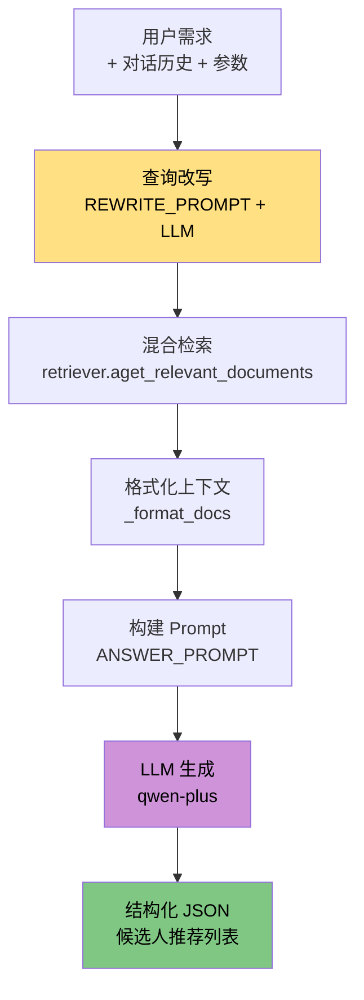
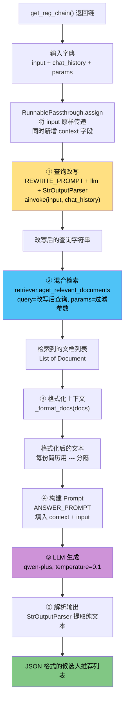

# 03 — RAG 检索链模块

> **对应源文件**：`rag/chain.py`
> **在架构中的位置**：Agent 层的执行引擎，负责把检索到的简历变成结构化的推荐结果。

## 一、核心问题

> 检索到了一堆简历片段，怎么把它们变成用户能看的、结构化的推荐结果？

02 模块解决了"怎么检索"，但检索出来的是一堆 `Document` 对象——里面有文本、有元数据，但用户看不懂。RAG 链要做的就是把这些原始检索结果变成**结构化的候选人推荐列表**。

这中间需要解决三个问题：

| 问题 | 解决方式 |
| --- | --- |
| 用户说的太模糊，检索不到好结果 | 查询改写——结合对话历史补全语义 |
| 检索结果是碎片化的文档片段 | 格式化——把片段拼成 LLM 能理解的上下文 |
| LLM 可能照单全收所有结果 | 最终审核——让 LLM 判断是否真的匹配 |

如何解决？




## 二、前置知识

### 2.1 什么是 RAG？

**RAG = Retrieval-Augmented Generation（检索增强生成）**

**类比**：你是一个面试官，面试一个候选人时：

- **没有 RAG**：你只能凭自己的记忆和知识来评估候选人，可能会遗漏关键信息
- **有 RAG**：你先翻开候选人的简历（检索），然后结合简历内容来提问和评估（生成）

RAG 让 LLM 不再只依赖自己的"记忆"（训练数据），而是能实时查阅"参考资料"（检索到的文档），从而给出更准确、更有依据的回答。

### 2.2 什么是查询改写（Query Rewriting）？

**类比**：你在图书馆问管理员"找个产品经理的简历"——管理员不会直接去翻架子上写着"产品经理"的书，而是先理解你到底要什么。

| 原始查询 | 改写后 |
| --- | --- |
| "找个产品经理" | "AI大模型方向产品经理，具备LLM产品化经验" |
| "我要一个后端" | "Java后端开发工程师，熟悉微服务架构" |
| "上次那个女的那个呢" | "在之前推荐的女性候选人中进一步筛选" |

为什么要改写？因为用户的原始查询往往是**模糊的、不完整的**。但有了对话历史，改写后的查询会补充之前的上下文信息，让检索更精准。

### 2.3 什么是 LCEL？

**LCEL = LangChain Expression Language**

LCEL 是 LangChain 提供的链式编排语法，让你用 `|` 管道符把多个步骤串成一条流水线：

```python
chain = step1 | step2 | step3
```

等价于：

```python
result = step3(step2(step1(input)))
```

LCEL 的优势：
- **声明式**：一眼就能看出流水线的结构
- **异步支持**：用 `ainvoke` 自然支持异步
- **可组合**：任何步骤都可以替换

本项目用 LCEL 构建了两个链：查询改写链（`REWRITE_PROMPT | llm | StrOutputParser()`）和最终 RAG 链（`RunnablePassthrough.assign | ANSWER_PROMPT | llm | StrOutputParser()`）。

## 三、函数/方法调用关系

`chain.py` 只有两个函数，调用关系简单：

```
get_rag_chain()                        # 对外接口，返回完整的 RAG 链
  └── retrieve_and_format_context()    # 内部闭包：查询改写 → 检索 → 格式化
        ├── REWRITE_PROMPT | llm       # 查询改写链
        ├── retriever.aget_relevant_documents()  # 混合检索（02模块）
        └── _format_docs()             # 文档格式化
```

对外暴露的只有 `get_rag_chain()`，04 模块的 `SmartRecruitAgent` 调用它获取链实例。

## 四、处理流程



**流程说明**：

1. **查询改写**：用户的原始输入 + 对话历史 → LLM 生成更精确的检索查询
2. **混合检索**：用改写后的查询调用 02 模块的 `aget_relevant_documents`，携带 params 做元数据过滤
3. **格式化上下文**：把 Document 列表拼成一段格式化的文本，每份简历之间用 `---` 分隔
4. **构建 Prompt**：把格式化的上下文 + 原始用户输入填入 ANSWER_PROMPT
5. **LLM 生成**：qwen-plus 作为"最终审核人"，判断简历是否真的匹配需求
6. **解析输出**：StrOutputParser 从 LLM 的 AIMessage 中提取纯文本字符串

## 五、核心函数解析

### 方法索引

| # | 组件/函数 | 作用 |
| --- | --- | --- |
| 5.1 | 模块初始化（导包 + LLM + retriever） | 初始化全局组件 |
| 5.2 | REWRITE_PROMPT | 查询改写提示词模板 |
| 5.3 | ANSWER_PROMPT | 答案生成提示词模板 |
| 5.4 | `_format_docs` | 把 Document 列表格式化为文本 |
| 5.5 | `get_rag_chain` | 构建并返回完整的 RAG 链 |

### 5.1 模块初始化（导包 + LLM + retriever）

`chain.py` 的前 22 行是模块级初始化——在 `import` 时就执行，不需要调用任何函数：

```python
# rag/chain.py
import asyncio
import os
from typing import List, Dict, Any
from langchain_core.prompts import ChatPromptTemplate, MessagesPlaceholder
from langchain_core.runnables import RunnablePassthrough, RunnableLambda, RunnableConfig
from langchain_openai import ChatOpenAI
from langchain_core.documents import Document
from langchain_core.output_parsers import StrOutputParser
from loguru import logger
from config import config
from utils.vector_store import VectorStore

# 初始化LLM和检索器
llm = ChatOpenAI(
    model_name="qwen-plus",
    openai_api_key=config.DASHSCOPE_API_KEY,
    openai_api_base="https://dashscope.aliyuncs.com/compatible-mode/v1",
    temperature=0.1
)
retriever = VectorStore()
```

**逐行解读**：

- `llm = ChatOpenAI(...)`：通过 DashScope 兼容接口调用通义千问 qwen-plus 模型。`temperature=0.1` 接近确定性输出，保证推荐结果的稳定性
- `retriever = VectorStore()`：初始化 02 模块的检索器实例。**注意：构造函数会立即连接** Milvus、MongoDB、ES 三个数据库，同时加载 BGE-M3 嵌入模型和 Reranker 模型。这不是懒加载——`VectorStore()` 一调用就是一次重量级初始化（参见 `vector_store.py` 的 `__init__` → `_initialize_components`）
- 这两个是**模块级全局变量**，文件内所有函数共享同一个实例

### 5.2 REWRITE_PROMPT — 查询改写提示词

```python
REWRITE_PROMPT = ChatPromptTemplate.from_messages([
    ("system", """
    你是一位专业的招聘助理。请根据对话历史和用户的最新输入，
    将用户的最新需求改写为一个清晰、独立、适合检索的查询语句。
    要求：
    1. 结合对话历史补充上下文信息（如之前提到的筛选条件）
    2. 消除代词指代（"他""那个人"→具体的人名或条件）
    3. 输出只有改写后的查询，不要解释
    """),
    MessagesPlaceholder(variable_name="chat_history"),
    ("user", "{input}"),
])
```

**模板结构**：三个消息槽位——system 角色设定、对话历史（`MessagesPlaceholder`）、用户最新输入。

**MessagesPlaceholder 的作用**：在模板中预留一个"对话历史"的占位符。调用时传入 `chat_history` 列表，LangChain 自动把每条消息展开为对应的 HumanMessage/AIMessage。这样改写链就能理解多轮对话的上下文。

### 5.3 ANSWER_PROMPT — 答案生成提示词

```python
ANSWER_PROMPT = ChatPromptTemplate.from_messages([
    ("system", """
作为资深技术招聘官和最终审核人，根据【用人需求】和【简历上下文】推荐最匹配的候选人。

【简历上下文】:
---
{context}
---

输出要求：
1. **最终审核**：作为最后一道关卡，确保简历与【用人需求】高度相关。
2. **精准推荐**：仅当简历高度匹配时，生成推荐理由；忽略勉强相关或无关的简历。
3. **JSON 格式**：严格按以下格式输出可能为空的列表，不添加额外解释：
    ```json
    [
        {{
            "candidate_id": 1,
            "reason": "推荐理由...",
            "file_path": "简历文件名.pdf",
            "doc_hash": "简历哈希值"
        }},
        ...
    ]
    ```
    """),
    ("user", "【用人需求】: {input}"),
])

```

**设计要点**：

- `{context}` 占位符：接收 `retrieve_and_format_context` 闭包返回的格式化文本
- `{input}` 占位符：用户的原始查询（不是改写后的查询）
- 双花括号 `{{` `}}`：Python f-string 的转义语法，表示字面量的 `{` 和 `}`，不被模板引擎解析
- "最终审核人"角色设定：强调 LLM 应主动过滤弱匹配结果，而不是机械返回所有检索结果

### 5.4 `_format_docs` — 文档格式化

```python
def _format_docs(docs: List[Document]) -> str:
    if not docs:
        return "未在简历库中找到相关信息。"
    formatted_docs = []
    for doc in docs:
        doc_hash = doc.metadata.get("doc_hash", doc.metadata.get("hash", "N/A"))
        doc_str = (
            f"简历来源文件: {os.path.basename(doc.metadata.get('file_path', 'N/A'))}\n"
            f"简历哈希值: {doc_hash}\n"
            f"内容: {doc.page_content}"
        )
        formatted_docs.append(doc_str)
    return "\n\n---\n\n".join(formatted_docs)
```

**设计要点**：

- `doc_hash` 的获取用了两个 key（`doc_hash` 和 `hash`）做兼容——Milvus 返回的元数据 key 和 ES 可能不同
- `os.path.basename` 只取文件名，不暴露完整路径
- 简历之间用 `---` 分隔，让 LLM 能清晰区分不同简历
- **空结果处理**：返回"未找到相关信息"而不是空字符串，避免 LLM 在没有上下文时胡编

### 5.5 `get_rag_chain` — 构建 RAG 链

```python
async def get_rag_chain():
    """构建并返回支持历史记录和动态参数的异步 RAG 链。"""

    async def retrieve_and_format_context(input_dict: dict, config: RunnableConfig) -> str:
        # 1. 改写查询
        rewritten_question = await (REWRITE_PROMPT | llm | StrOutputParser()).ainvoke(
            {"input": input_dict["input"], "chat_history": input_dict["chat_history"]},
            config=config
        )
        logger.info(f"原始查询: '{input_dict['input']}' -> 改写后查询: '{rewritten_question}'")

        # 2. [升级] 解析参数并构建Filter表达式
        params = input_dict.get("params", {})

        # 3. [升级] 异步执行高级混合检索
        try:
            retrieved_docs = await retriever.aget_relevant_documents(
                query=rewritten_question,
                params=params
            )
        except Exception as e:
            logger.error(f"检索器执行失败: {e}", exc_info=True)
            return "检索简历时发生内部错误，请稍后再试。"

        # 4. 格式化
        context = _format_docs(retrieved_docs)
        logger.debug(f"为LLM准备的上下文: \n{context}")
        return context

    # 构建最终链
    conversational_rag_chain = (
            RunnablePassthrough.assign(
                context=retrieve_and_format_context
            )
            | ANSWER_PROMPT
            | llm
            | StrOutputParser()
    )

    return conversational_rag_chain
```

**逐行解读**：

1. **闭包设计**：`retrieve_and_format_context` 是一个闭包，定义在 `get_rag_chain` 内部。它不是独立的函数，而是链的一部分。这样做的好处是可以访问外部作用域的 `retriever` 和 `llm`。

2. **`RunnablePassthrough.assign(context=...)`**：这是 LCEL 的关键操作——把输入字典（input, chat_history, params）**原封不动传递**，同时**新增**一个 `context` 字段。最终传给 ANSWER_PROMPT 的数据结构是：
   ```python
   {"input": "原始用户输入", "chat_history": [...], "params": {...}, "context": "格式化后的简历文本"}
   ```

3. **检索异常处理**：检索器可能因为 Milvus/ES 连接问题失败，catch 后返回友好的错误文本，避免整个链崩溃

4. **`params` 透传**：用户传入的过滤参数（性别、年龄、经验等）直接透传给 `aget_relevant_documents`，在 02 模块的混合检索中用于构建 Milvus 的 filter 表达式

## 六、参数与设计决策

| 参数/决策 | 值 | 原因 |
| --- | --- | --- |
| LLM 模型 | `qwen-plus` | 阿里云 DashScope，中文理解能力强 |
| `temperature` | `0.1` | 推荐结果需要确定性输出，温度接近 0 减少随机性 |
| 查询改写 | LLM 改写而非规则 | 对话历史中的指代消解（"那个女的"→具体条件）需要语义理解 |
| 上下文格式 | `---` 分隔的 Markdown | 清晰的结构让 LLM 更容易区分不同简历 |
| LLM 角色 | "最终审核人" | 强调 LLM 应主动过滤弱匹配结果，而非照单全收 |
| 输出格式 | 严格 JSON | 方便前端解析渲染为候选人卡片 |
| 检索异常 | 返回友好文本而非抛异常 | 保证链不中断，用户能看到错误提示 |


## 七、模块接口总结

本模块对外只暴露一个函数，调用方通过它获取完整的 RAG 链。

| 接口 | 类型 | 输入 | 输出 | 说明 |
| --- | --- | --- | --- | --- |
| get_rag_chain() | async 函数 | 无参数 | RunnableSequence | 返回完整的 RAG 链，调用方用 ainvoke 执行 |
| 链的输入 | - | input, <br />chat_history, <br />params | - | input: 用户查询，<br />chat_history: 消息列表，<br />params: 过滤参数 |
| 链的输出 | - | - | str | JSON 格式的候选人推荐列表 |

## 八、运行验证

```python
if __name__ == '__main__':
    async def main():
        """独立验证RAG Chain的核心功能"""
        logger.info("=" * 50)
        logger.info("开始独立验证 chain.py 模块...")

        rag_chain = await get_rag_chain()

        # --- 测试用例 1: 简单的招聘需求 ---
        print("\n--- 测试用例 1: 简单招聘需求 ---")
        query1 = "我需要一个懂AI算法的工程师"
        params1 = {"count": 2}
        print(f"用户: {query1}, 参数: {params1}")

        response1 = await rag_chain.ainvoke({
            "input": query1,
            "chat_history": [],
            "params": params1
        })
        print(f"AI响应 (部分): {response1[:300]}...")
        assert response1 and isinstance(response1, str)
        print("【测试用例 1 通过】")

        # --- 测试用例 2: 带筛选条件的招聘需求 ---
        print("\n--- 测试用例 2: 带筛选条件的招聘需求 ---")
        query2 = "帮我找一个有5年以上经验的算法工程师"
        params2 = {"count": 1, "experience_min": 5}
        print(f"用户: {query2}, 参数: {params2}")

        response2 = await rag_chain.ainvoke({
            "input": query2,
            "chat_history": [],
            "params": params2
        })
        print(f"AI响应 (部分): {response2[:300]}...")
        assert response2 and isinstance(response2, str)
        print("【测试用例 2 通过】")

        logger.info("=" * 50)
        logger.success("chain.py 模块所有功能验证通过！")

    asyncio.run(main())
```

**验证步骤**：

| 步骤 | 操作 | 预期结果 |
| --- | --- | --- |
| 1 | 启动 Milvus + ES + MongoDB 服务 | 三个数据库正常运行 |
| 2 | 确保已有简历数据入库 | `system_data_init.py` 已执行 |
| 3 | `python rag/chain.py` | 两个测试用例全部通过 |
| 4 | 检查日志输出 | 能看到"原始查询→改写后查询"的日志 |

---

→ 上一篇：[02-vector-store — 向量存储与检索](../02-vector-store/)
→ 下一篇：[04-rag-pipeline — 意图路由 Agent](../04-rag-pipeline/)
