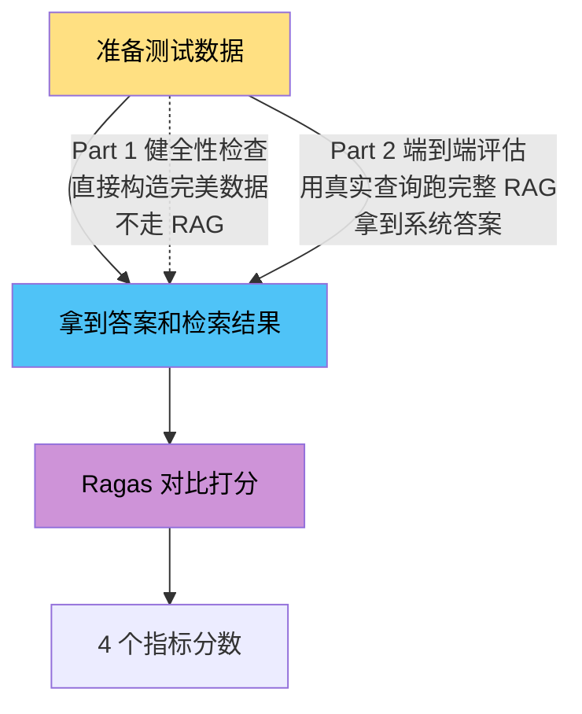
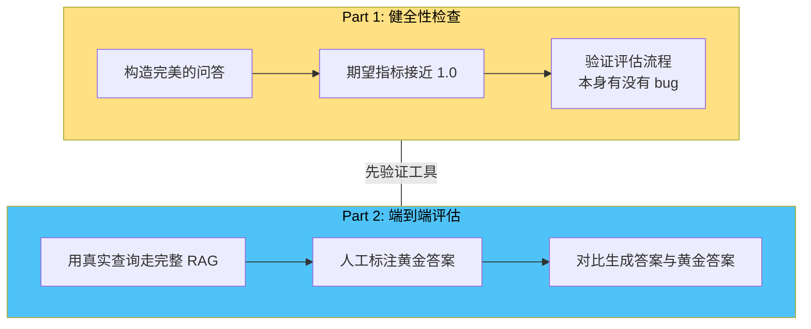
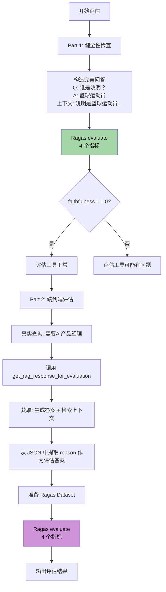

# 05 — 评估模块

> **对应源文件**：`eval/evaluator.py`
> **在架构中的位置**：独立的质量保障模块，用 Ragas 框架量化评估 RAG 系统的检索和生成质量。

---

## 一、核心问题

> 怎么知道我们的 RAG 系统好不好？检索准不准？答案靠不靠谱？

不能只凭感觉说"还不错"，需要**量化的指标**来衡量。这就是评估模块的价值。

评估模块回答四个问题：

| 问题 | 对应指标 | 不好会怎样 |
| --- | --- | --- |
| 答案是不是瞎编的？ | Faithfulness（忠实度） | 推荐了不存在的候选人 |
| 答案有没有回答用户的问题？ | Answer Relevancy（答案相关性） | 用户问"谁会大数据"，回答"张三会Java" |
| 检索到的内容里，有用的信息排前面了吗？ | Context Precision（上下文精确度） | 检索了 5 份简历，最相关的排在末尾 |
| 该检索到的重要内容有没有漏掉？ | Context Recall（上下文召回度） | 简历库里有个完美匹配的，但没检索到 |

评估分两步走：**先验证工具能不能用，再评估系统好不好**。



两条路径共用同一条后半段（交给 Ragas 打分），区别在前半段：
- **Part 1 健全性检查**：直接手写完美的问答数据（问题+答案+上下文），不走 RAG。目的是验证 Ragas 工具链本身有没有 bug——如果一道送分题都判错，说明评分系统有问题
- **Part 2 端到端评估**：用真实查询跑完整 RAG 系统，拿到系统生成的答案和检索到的文档，再交给 Ragas 打分。目的是评估 RAG 系统的真实表现

---

## 二、前置知识

### 2.1 什么是 Ragas？

**Ragas = Retrieval Augmented Generation Assessment**

Ragas 是一个专门评估 RAG 系统的开源框架。它用 LLM 作为"评判者"，自动对 RAG 的输出打分。

> 📖 官方文档：<https://docs.ragas.io/> | GitHub：<https://github.com/explodinggradients/ragas>

**类比**：Ragas 就像一个"阅卷老师"——你把学生的答卷（RAG 输出）和标准答案（ground_truth）交给它，它自动批改并给出分数。

### 2.2 四个评估指标详解

> 📖 指标详细说明见 Ragas 官方文档：<https://docs.ragas.io/en/latest/concepts/metrics/available_metrics/>

**Faithfulness（忠实度）**：答案是否只基于检索到的上下文，没有胡编。

> 检索到："张三会 Python 和 Java"
> LLM 回答："张三精通 Python 和 Go" ← 不忠实（Go 是编的）

**Answer Relevancy（答案相关性）**：答案是否切题。

> 用户问："谁有大数据经验？"
> LLM 回答："张三会 Java" ← 不相关（没回答大数据）

**Context Precision（上下文精确度）**：检索到的内容中，有用的信息是否排在了前面。

> 检索了 5 份简历，最相关的排在第 1、2 位 → 精确度高
> 检索了 5 份简历，最相关的却排在第 4、5 位 → 精确度低（虽然检到了，但排在后面）

**Context Recall（上下文召回度）**：该检索到的有没有漏掉。

> 简历库里明明有个完美匹配的 AI 产品经理，但没检索到 → 召回度低

### 2.3 评估的两种方式



**健全性检查（Sanity Check）**：先验证评估工具本身是否正常工作。就像考试前先校准评分标准——如果一道送分题都判错了，说明评分系统有 bug。

**端到端评估**：用真实的查询走完整的 RAG 流程，评估实际表现。

### 2.4 适配器模式

Ragas 框架需要嵌入模型接口（`embed_query` / `embed_documents`），但本项目用的是自己的 BGE-M3。需要一个**适配器**把 BGE-M3 包装成 Ragas 认识的接口。

**类比**：你买了一个欧标的插头（BGE-M3），但家里只有国标的插座（Ragas）。适配器就是一个转换头。

---

## 三、函数/方法调用关系

```
main()                                    # 入口
  ├── run_evaluator_sanity_check()        # Part 1: 健全性检查（同步）
  │     └── run_evaluation(dataset)       # Ragas evaluate
  └── run_end_to_end_evaluation()         # Part 2: 端到端评估（异步）
        ├── get_rag_response_for_evaluation()  # 封装的 RAG 管道
        │     ├── REWRITE_PROMPT | llm    # 查询改写（复用 03 模块）
        │     ├── retriever.aget_relevant_documents()  # 混合检索
        │     └── ANSWER_PROMPT | llm     # 答案生成
        └── run_evaluation(dataset)       # Ragas evaluate

辅助类：
  RagasBgeM3EmbeddingsAdapter             # BGE-M3 → Ragas 接口适配器
```

---

## 四、处理流程



---

## 五、核心函数解析

### 方法索引

> 导包与初始化（import、全局配置、适配器、LLM 实例）见下方 5.0 节。

| # | 函数/类 | 作用 |
| --- | --- | --- |
| 5.1 | `get_rag_response_for_evaluation` | 封装的 RAG 管道 |
| 5.2 | `run_evaluation` | Ragas 评估封装 |
| 5.3 | `run_evaluator_sanity_check` | 健全性检查 |
| 5.4 | `run_end_to_end_evaluation` | 端到端评估 |

### 5.0 导包与初始化

```python
# --- 步骤 1: 导入所需库与模块 ---
import json
import os
import asyncio
from typing import List, Dict, Any, Tuple

from datasets import Dataset
from langchain_openai import ChatOpenAI
from loguru import logger
from ragas import evaluate
from ragas.metrics import (
    faithfulness,
    answer_relevancy,
    context_recall,
    context_precision,
)
from ragas.evaluation import EvaluationResult
from langchain_core.documents import Document
from langchain_core.runnables import RunnableConfig
from langchain_core.output_parsers import StrOutputParser

from config import config
from milvus_model.hybrid import BGEM3EmbeddingFunction
from rag.chain import llm, retriever, REWRITE_PROMPT, ANSWER_PROMPT, _format_docs
```

**导入来源说明**：
- `ragas` 系列：评估框架（`evaluate`）+ 4 个指标 + 结果类型
- `langchain_*` 系列：LangChain 核心（Document、RunnableConfig、StrOutputParser）
- `rag.chain`：**复用** 03 模块的组件（`llm`、`retriever`、`REWRITE_PROMPT`、`ANSWER_PROMPT`）——评估模块不重新造轮子
- `milvus_model.hybrid`：BGE-M3 嵌入模型，用于适配 Ragas 的嵌入接口

```python
# --- 步骤 2: 适配器类定义 ---
class RagasBgeM3EmbeddingsAdapter:
    """Ragas框架的嵌入模型适配器，将BGEM3EmbeddingFunction封装为Ragas可识别的接口。"""

    def __init__(self, *args, **kwargs):
        self.bge_function = BGEM3EmbeddingFunction(*args, **kwargs)

    def embed_query(self, text: str) -> List[float]:
        """实现 Ragas 的查询嵌入接口，将单个文本转为稠密向量。"""
        return self.bge_function.encode_queries([text])["dense"][0]

    def embed_documents(self, texts: List[str]) -> List[List[float]]:
        """实现 Ragas 的文档嵌入接口，将文本列表转为向量列表。"""
        return self.bge_function.encode_documents(texts)["dense"]
```

**适配器设计要点**：
- 只提取 `["dense"]` 稠密向量——Ragas 的嵌入接口只需要标准稠密向量，不需要稀疏向量
- `embed_query` 传入单条文本，返回单个向量（`[0]` 取第一个）
- `embed_documents` 传入文本列表，返回向量列表
- 构造参数透传（`*args, **kwargs`），适配器不关心 BGE-M3 的具体初始化参数

```python
# --- 步骤 3: 全局配置与初始化 ---
logger.add(os.path.join(config.LOG_DIR, "evaluator.log"), rotation="10 MB", encoding="utf-8")

ragas_llm = ChatOpenAI(
    model="qwen-plus",
    api_key=config.DASHSCOPE_API_KEY,
    base_url="https://dashscope.aliyuncs.com/compatible-mode/v1",
)

ragas_embeddings = RagasBgeM3EmbeddingsAdapter(
    model_name=os.path.join(config.MODEL_PATH, config.EMBEDDING_MODEL),
    device="cpu",
    use_fp16=False,
)
```

**两个独立实例**：
- `ragas_llm`：评估专用的 LLM，与 RAG 链的 `llm` 分离，避免"自己评自己"
- `ragas_embeddings`：通过适配器封装的 BGE-M3，供 Ragas 计算语义相似度

### 5.1 `get_rag_response_for_evaluation` — 评估专用 RAG 管道

```python
async def get_rag_response_for_evaluation(
        query: str, params: Dict[str, Any]
) -> Tuple[str, List[Document]]:
    # 3.1 查询改写
    rewritten_question = await (REWRITE_PROMPT | llm | StrOutputParser()).ainvoke(
        {"input": query, "chat_history": []},
        config=RunnableConfig()
    )

    # 3.2 混合检索
    retrieved_docs = await retriever.aget_relevant_documents(
        query=rewritten_question, params=params
    )

    # 3.3 去重
    unique_contexts = []
    seen_content = set()
    for doc in retrieved_docs:
        if doc.page_content not in seen_content:
            unique_contexts.append(doc.page_content)
            seen_content.add(doc.page_content)
    context_str = "\n".join(unique_contexts)

    # 3.4 生成答案
    final_answer = await (ANSWER_PROMPT | llm | StrOutputParser()).ainvoke(
        {"input": query, "context": context_str},
        config=RunnableConfig()
    )

    return final_answer, retrieved_docs
```

**为什么不直接用 03 模块的 RAG 链？** 因为评估需要拿到**中间产物**——检索到的原始文档列表（`retrieved_docs`），而 03 模块的链只返回最终答案。这个函数把链的每一步拆开，保留了中间结果。

**额外步骤：去重**。3.3 节按 `page_content` 去重——同一个文档的不同分段可能被重复检索到，评估时需要去重避免重复计数。

### 5.2 `run_evaluation` — Ragas 评估封装

```python
def run_evaluation(dataset: Dataset) -> EvaluationResult:
    result = evaluate(
        dataset,
        metrics=[faithfulness, answer_relevancy, context_precision, context_recall],
        llm=ragas_llm,
        embeddings=ragas_embeddings,
    )
    return result
```

四个指标和它们需要的输入：

| 指标 | 使用的字段 | 评估什么 |
| --- | --- | --- |
| `faithfulness` | answer + contexts | 答案是否忠于检索内容 |
| `answer_relevancy` | answer + question | 答案是否切题 |
| `context_precision` | contexts + question + ground_truth | 有用的信息是否排在前面 |
| `context_recall` | contexts + ground_truth | 是否漏检重要内容 |

### 5.3 `run_evaluator_sanity_check` — 健全性检查

```python
def run_evaluator_sanity_check():
    print("\n--- Part 1: 评估流程健全性检查 ---")

    # 5.1 构造一个独立的、完美的中文测试样本。
    question = "谁是姚明？"
    ground_truth = "姚明是一名来自中国的篮球运动员，曾在NBA休斯顿火箭队效力。"
    contexts = ["姚明是一名来自中国的篮球运动员，他身高2米26，司职中锋，曾在NBA休斯顿火箭队效力。"]
    perfect_answer = "姚明是来自中国的篮球运动员，曾在休斯顿火箭队打球。"

    # 5.2 准备Ragas评估所需的Dataset格式。
    dataset = Dataset.from_dict({
        "question": [question],
        "answer": [perfect_answer],
        "contexts": [contexts],
        "ground_truth": [ground_truth],
    })

    print(f"健全性检查 - 输入问题: {question}")

    # 5.3 执行评估并打印结果。
    result = run_evaluation(dataset)
    print("\n健全性检查 - 评估结果:")
    print(result)

    # 5.4 断言检查，验证核心指标是否达到预期。
    # 由于是单行评估，Ragas返回的指标是包含单个元素的列表，需要使用索引[0]来获取值。
    if result['faithfulness'][0] < 1.0:
        print("[警告] 健全性检查未通过！Faithfulness 应为 1.0。")
    else:
        print("[成功] 健全性检查通过！评估工具链工作正常。")
    print("--- 健全性检查结束 ---")
```

**设计思路**：构造一个"不可能出错"的测试样本——答案完美匹配上下文和问题。如果连这个都评估失败，说明 Ragas 工具链本身有问题（模型配置错、API 不可达等）。

### 5.4 `run_end_to_end_evaluation` — 端到端评估

```python
async def run_end_to_end_evaluation():
    print("\n--- Part 2: RAG系统端到端评估 ---")

    # 6.1 定义一个真实的测试查询和对应的"黄金标准"答案。
    test_query = "需要一位熟悉AI大模型的产品经理"
    test_ground_truth = "该候选人拥有AI大模型相关的产品管理经验，具备大语言模型（LLM）、NLP等技术理解能力，与岗位需求高度匹配，完全符合用人需求。熟悉AI模型开发流程、应用场景设计及产品化落地。他具备需求分析、产品规划、跨团队协作和商业化方案设计能力"
    test_params = {"count": 1}

    # 6.2 调用为评估封装的RAG管道函数，获取LLM生成的答案和检索到的文档。
    generated_json, retrieved_docs = await get_rag_response_for_evaluation(test_query, test_params)

    # 6.3 解析RAG返回的JSON，提取自然语言答案。
    natural_language_answer = ""
    try:
        # 清理可能存在的Markdown代码块标记。
        clean_json_str = generated_json.strip().removeprefix("```json").removesuffix("```").strip()
        # 将清理后的字符串解析为JSON对象。
        response_data = json.loads(clean_json_str)
        # 从JSON中提取推荐理由作为评估答案。
        if response_data and isinstance(response_data, list):
            natural_language_answer = response_data[0].get("reason", "")
    except (json.JSONDecodeError, IndexError, AttributeError) as e:
        # 捕获JSON解析错误，并记录警告。
        logger.warning(f"无法从RAG响应中解析推荐理由: {generated_json}, 错误: {e}")
        # 保持答案为空，评估结果将反映出解析失败的问题。
        natural_language_answer = ""

    # 6.4 将检索到的Document对象列表转换为Ragas所需的字符串列表。
    string_contexts = [doc.page_content for doc in retrieved_docs]

    # 6.5 准备Ragas评估所需的数据集。
    dataset = Dataset.from_dict({
        "question": [test_query],
        "answer": [natural_language_answer],
        "contexts": [string_contexts],
        "ground_truth": [test_ground_truth],
    })

    print(f"端到端评估 - 输入问题: {test_query}")
    print(f"端到端评估 - RAG生成的推荐理由: {natural_language_answer or '未能成功解析'}")

    # 6.6 执行评估并打印结果。
    result = run_evaluation(dataset)
    print("\n端到端评估 - 评估结果:")
    print(result)
    print("--- 端到端评估结束 ---")
```

**关键步骤**：6.3 节从 RAG 返回的 JSON 中提取 `reason` 字段作为评估用的 `answer`。RAG 链返回的是完整的候选人 JSON（包含 candidate_id、reason、file_path 等），但 Ragas 需要的是**自然语言答案**，所以只取 `reason`。

---

## 六、参数与设计决策

| 决策 | 选择 | 原因 |
| --- | --- | --- |
| 评估框架 | Ragas | 开源、支持中文、提供 4 个核心 RAG 指标 |
| 评估用 LLM | `qwen-plus`（独立实例） | 与 RAG 链的 LLM 分离，避免自己评自己 |
| 嵌入模型适配器 | 只用稠密向量 | Ragas 接口只需要标准稠密向量，不需要稀疏向量 |
| 健全性检查先行 | 先验证工具再评估系统 | 如果评估工具本身有 bug，后续评估结果无意义 |
| RAG 管道独立封装 | 不复用 03 模块的链 | 评估需要拿到中间产物（检索到的文档列表） |

---

## 七、模块接口总结

| 接口 | 类型 | 输入 | 输出 | 说明 |
| --- | --- | --- | --- | --- |
| `RagasBgeM3EmbeddingsAdapter` | 类 | BGE-M3 参数 | 适配器实例 | 包装为 Ragas 兼容接口 |
| `get_rag_response_for_evaluation` | async 函数 | `query` + `params` | `(answer, docs)` | 评估专用的 RAG 管道 |
| `run_evaluation` | 同步函数 | `Dataset` | `EvaluationResult` | Ragas 评估封装 |
| `run_evaluator_sanity_check` | 同步函数 | 无 | 打印结果 | 健全性检查 |
| `run_end_to_end_evaluation` | async 函数 | 无 | 打印结果 | 端到端评估 |

---

## 八、运行验证

```python
if __name__ == "__main__":
    async def main():
        # 7.1 健全性检查（同步）
        run_evaluator_sanity_check()
        # 7.2 端到端评估（异步）
        await run_end_to_end_evaluation()

    asyncio.run(main())
```

**验证步骤**：

| 步骤 | 操作 | 预期结果 |
| --- | --- | --- |
| 1 | 启动所有数据库 + 确保有简历数据 | 服务正常 |
| 2 | `python eval/evaluator.py` | 健全性检查通过，faithfulness ≈ 1.0 |
| 3 | 等待端到端评估完成 | 输出 4 个指标分数 |
| 4 | 检查日志 | 能看到查询改写、检索数量、去重结果 |

### 评估的局限性

1. **需要人工标注 ground_truth**：标注成本高，且标注质量直接影响评估结果
2. **LLM 作为评判者**：Ragas 用 LLM 来打分，LLM 本身可能不稳定
3. **单一查询评估不够**：本项目的端到端评估只有一个测试查询，仅供演示。生产环境需要构造包含数十个查询的测试集
4. **中文支持**：Ragas 对中文的评估准确度可能低于英文，需要关注指标是否合理

---

→ 上一篇：[04-rag-pipeline — 意图路由 Agent](../04-rag-pipeline/)
→ 下一篇：[06-app — Web 应用](../06-app/)
