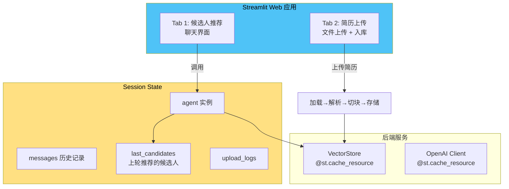
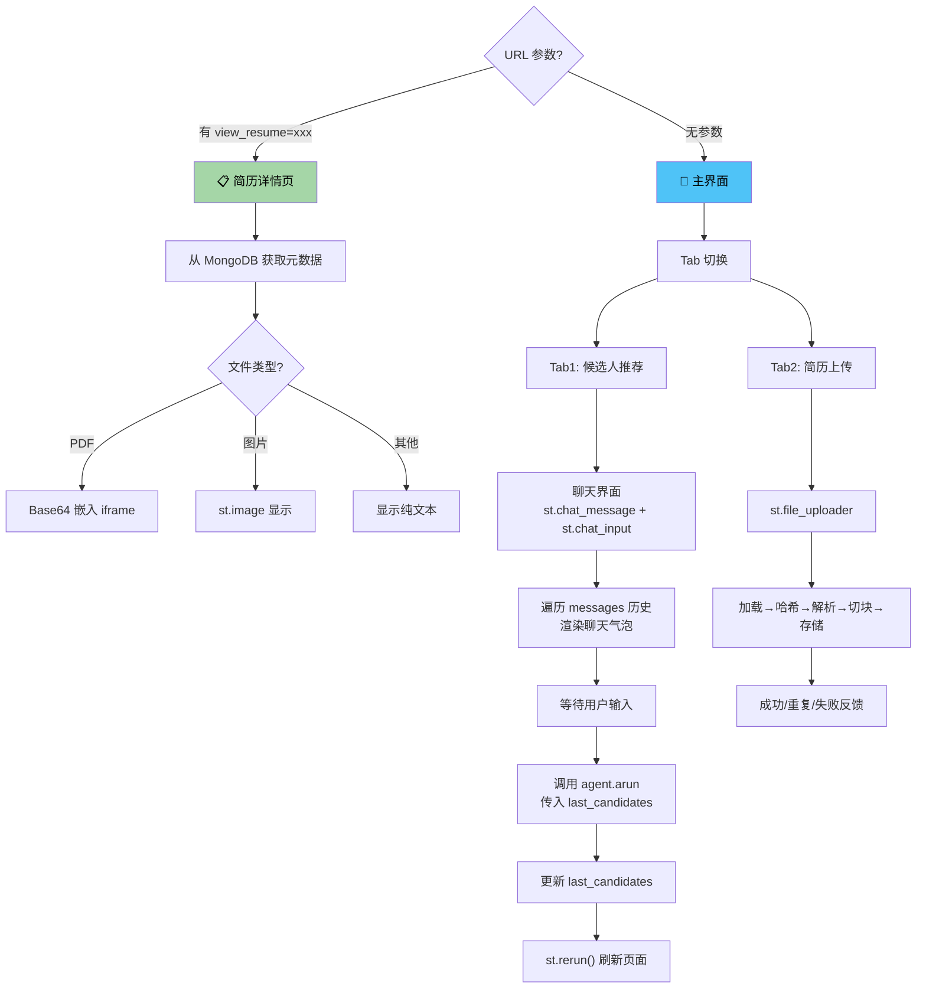
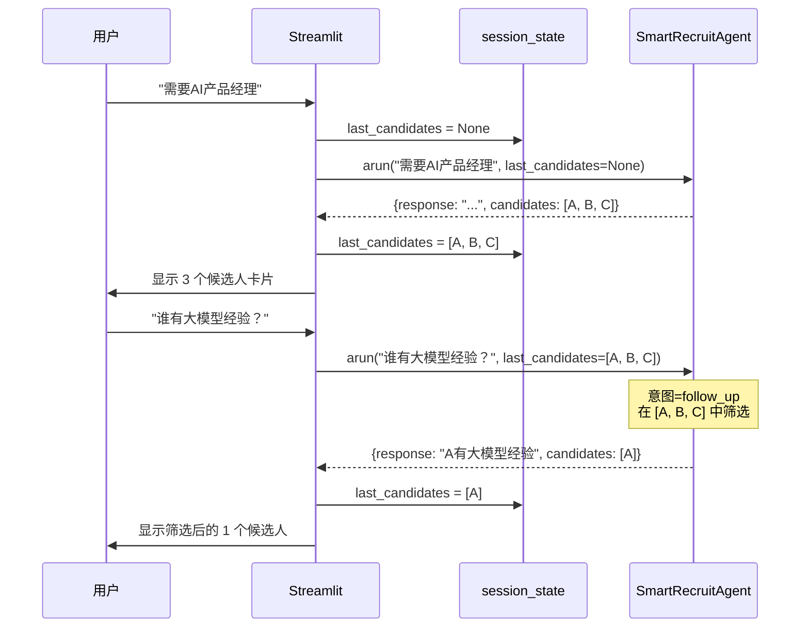
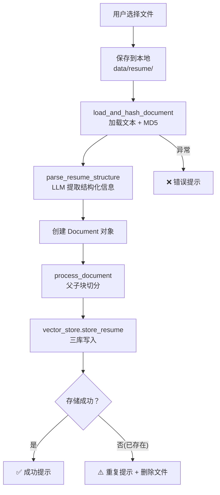

# 06 — Web 应用模块

> **对应源文件**：`app.py`
> **在架构中的位置**：交互层，用户直接接触的界面。



---

## 一、核心问题

> 怎么把后端的 RAG 能力变成一个普通用户能用的 Web 产品？

---

## 二、前置知识

### 2.1 什么是 Streamlit？

**类比**：如果你想让一个 Python 程序有网页界面，传统方式是用 Flask/FastAPI 写后端 + React/Vue 写前端，需要两套技术栈。Streamlit 让你**只用 Python** 就能写出一个看起来不错的 Web 应用。

```python
# 就这么简单
import streamlit as st
st.title("SmartRecruit")
name = st.text_input("请输入姓名")
if name:
    st.write(f"你好, {name}!")
```

**为什么选 Streamlit？**
- 开发速度快，适合做原型和演示
- 不需要写 HTML/CSS/JavaScript
- 内置组件（聊天框、文件上传、按钮、进度条等）
- 适合 AI 应用的快速迭代

### 2.2 什么是 Session State？

**类比**：你走进一家银行，柜员会给你一个**排队号**。这个号牌就是你的"会话标识"——柜员用它记住你是谁、你之前办了什么业务。

Streamlit 的 `st.session_state` 就是这个"号牌"。Streamlit 每次用户交互都会**重新执行整个脚本**，如果不把数据存在 session_state 里，所有状态都会丢失。

```python
# 如果没有 session_state，每次刷新都重新创建
if "agent" not in st.session_state:
    st.session_state.agent = SmartRecruitAgent()
    
if "last_candidates" not in st.session_state:
    st.session_state.last_candidates = None
```

### 2.3 @st.cache_resource

**类比**：公司前台有一个**快递柜**。第一个快递员来放了一个包裹，柜子会记住；后续只要快递员还拿同一个柜子，就直接取出来，不用重新存一遍。

`@st.cache_resource` 让昂贵的初始化操作（加载模型、连接数据库）**只执行一次**，后续调用直接返回缓存的结果。整个应用的多个用户共享这个缓存。

```python
@st.cache_resource
def get_vector_store():
    return VectorStore()  # 加载 BGE-M3、连接 Milvus/ES/MongoDB，很慢
    # 第二次调用不会执行，直接返回第一次的结果
```

---

## 三、界面架构



---

## 四、关键设计

### 4.1 异步适配

Streamlit 是同步框架，但 RAG 链是异步的（`async/await`）。需要一个桥接函数：

```python
def run_async(coro):
    loop = asyncio.get_running_loop()  # Streamlit 的事件循环
    return loop.run_until_complete(coro)
```

这里用了 `nest_asyncio` 来允许事件循环嵌套（Streamlit 内部已经有一个事件循环在跑）。

### 4.2 多轮对话的关键数据流



### 4.3 候选人卡片的渲染

```python
def render_candidate_cards(candidates, title):
    for i, candidate in enumerate(candidates, 1):
        with st.container(border=True):
            st.subheader(f"候选人 {i}: {文件名}")
            st.markdown(f"**推荐理由:** {reason}")
            st.markdown(f'<a href="?view_resume={doc_hash}">查看简历</a>')
```

- 用 `st.container(border=True)` 创建带边框的卡片
- 通过 URL 参数 `?view_resume=xxx` 实现简历详情的页面跳转
- Streamlit 每次都重新执行脚本，通过 `st.query_params` 读取 URL 参数来决定显示哪个页面

### 4.4 简历上传入库流程



---

## 五、StderrFilter 设计

```python
class StderrFilter:
    def __init__(self, original_stderr):
        self.filter_text = "Examining the path of torch.classes raised"
    
    def write(self, text):
        if self.filter_text not in text:
            self.original_stderr.write(text)
```

这是一个小技巧：PyTorch 加载时会输出一条无害的调试警告到 stderr，在 Streamlit 界面上会很碍眼。StderrFilter 把它过滤掉了。**生产环境不建议这样做**，应该正确配置日志级别。

---

## 六、初始化简历数据

所有模块代码已经就绪，在启动应用之前，需要将简历数据灌入数据库（MongoDB、Elasticsearch、Milvus）。

项目提供了自动化脚本 `system_data_init.py`，它会：

1. 扫描 `data/resume/` 目录下的所有简历文件（.md/.docx/.pdf/.txt/.jpg/.png）
2. 提取文本内容并解析结构化信息
3. 对文档进行切分
4. 将简历原文、结构化数据、文档向量分别存入三个数据库

> 前提：Docker 中间件已启动（详见 [00-deployment](../00-deployment/)），且 `.env` 文件中已配置 `DASHSCOPE_API_KEY`。

```bash
# 确保在虚拟环境中
conda activate smartrecruit  # 或 source .venv/bin/activate

# 执行数据初始化
python system_data_init.py
```

脚本会自动下载必要的 NLTK 数据（`punkt_tab`），无需手动操作。

执行完成后，控制台会输出处理结果统计（成功/已存在/失败数量）。之后即可启动应用。

---

## 七、启动应用

在项目根目录下执行：

```bash
streamlit run app.py
```

启动后浏览器自动打开 `http://localhost:8501`。如果端口被占用，可以指定其他端口：

```bash
streamlit run app.py --server.port 8502
```

### ⚠️ 启动时出现 torchvision 警告

首次启动时，终端可能刷大量 `ModuleNotFoundError: No module named 'torchvision'` 警告。这是 Streamlit 的文件监控器（watcher）扫描已安装的 `transformers` 包时触发的，**不影响应用正常运行**，页面能正常打开即可忽略。

如需消除警告，两种方案：

**方案1（推荐）：禁用 watcher**

```bash
streamlit run app.py --server.fileWatcherType none
```

缺点：修改代码后不会自动刷新，需手动刷新浏览器。

**方案2：安装 torchvision**

```bash
pip install torchvision
```

缺点：包体积约 1GB，本项目并不需要此依赖。

---

→ 上一篇：[05-evaluator — 评估模块](../05-evaluator/)
→ 下一篇：无（最后一讲）
