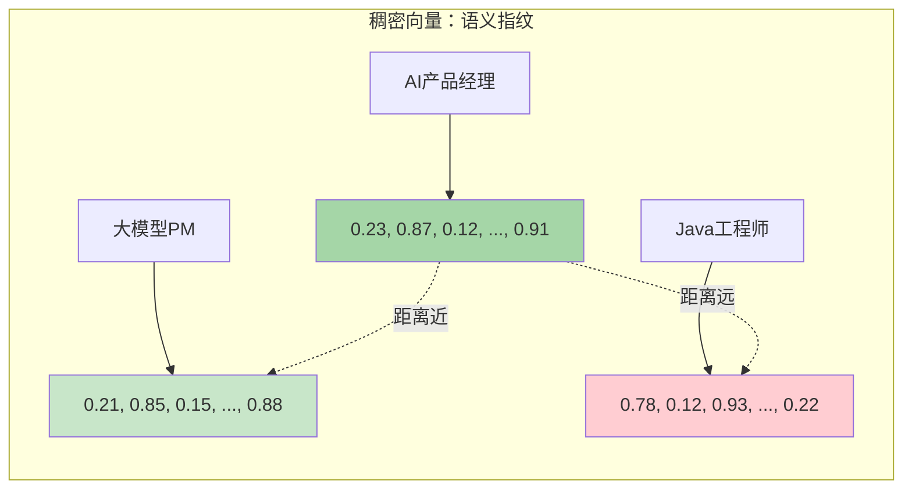
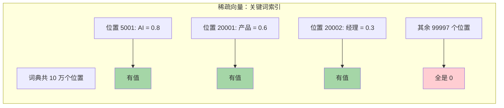
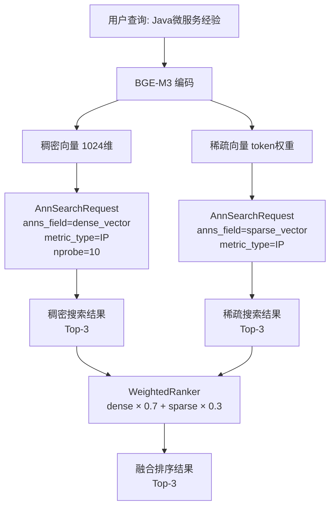
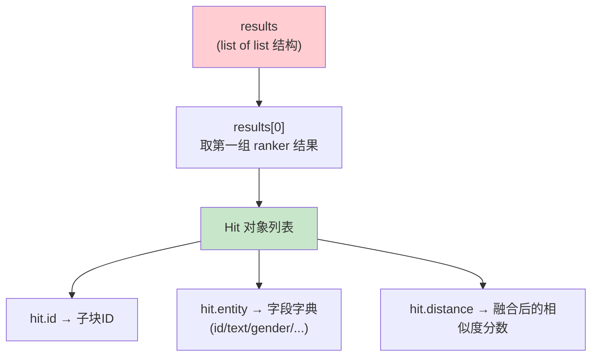

# Milvus 前置知识学习模块

> 本模块基于 SmartRecruit 项目中 `vector_store.py` 的实际使用，讲解 Milvus 向量数据库的核心操作。

---

## 一、核心问题：SmartRecruit 为什么需要 Milvus？

SmartRecruit 是一个智能简历筛选系统，核心需求是**语义搜索**：

- 用户查询"有 Java 微服务经验的候选人"
- 简历里写的是"主导电商平台服务端架构改造，QPS 从 500 提升到 5000"
- 关键字搜索**匹配不上**（"Java" 和 "微服务" 都没出现），但语义上是高度相关的

传统数据库（MySQL、MongoDB）只能做精确匹配或全文检索，无法理解"意思相近"。Milvus 专门解决这类问题：

1. **向量语义搜索**：把文本转成 1024 维浮点向量，用距离度量"语义相似度"
2. **元数据过滤**：在向量搜索的基础上叠加标量过滤（如 `gender == "男"`、`age < 30`），实现"语义匹配 + 精确条件"
3. **混合检索**：稠密向量（语义）+ 稀疏向量（词级）加权融合，兼顾泛化和精确

SmartRecruit 的架构是三数据库协作：

| 数据库 | 职责 | 本模块是否涉及 |
|---|---|---|
| Milvus | 向量存储 + 混合检索 | ✅ **本模块** |
| Elasticsearch | BM25 全文检索 | 参见 `../elasticsearch/` 模块 |
| MongoDB | 元数据存储 + 去重 | 参见 `../mongodb/` 模块 |

---

## 二、前置知识

理解 Milvus 需要掌握向量相关知识，按从底层到上层的顺序展开：

### 2.1 什么是向量？

计算机不能直接理解"AI产品经理"这句话的意思。向量是让计算机能"理解"文本的数学工具——把一段文本转换成一串数字，文本的含义越相似，这串数字就越接近。

**1024 维怎么理解？** 想象你用 1024 个标签来描述一个人：

| 维度编号 | 代表什么 | "AI产品经理"的值 | "Java工程师"的值 |
|---|---|---|---|
| 第 1 维 | 技术深度 | 0.6 | 0.9 |
| 第 2 维 | 产品思维 | 0.9 | 0.2 |
| 第 3 维 | 管理经验 | 0.7 | 0.3 |
| 第 4 维 | 编程能力 | 0.4 | 0.95 |
| 第 5 维 | 创意能力 | 0.8 | 0.3 |
| ... | ... | ... | ... |
| 第 1024 维 | （某个微妙的语义特征） | 0.12 | 0.88 |

当然，实际中这 1024 个维度**不是人工定义的**——模型自己学习出来的，人无法直接解释每个维度的含义。但它们组合在一起，就能精确区分"AI产品经理"和"Java工程师"。

这种"把文本变成数字"的过程叫**嵌入（Embedding）**，生成数字的模型叫**嵌入模型**。本项目用的是 **BGE-M3**，它一个模型能同时生成两种向量：

### 2.2 稠密向量（Dense Vector）

**一句话**：对文本整体语义的"浓缩指纹"，每个位置都有值。

**通俗理解**：想象一个老教授，你跟他说"我想找一本适合零基础、讲代码逻辑的书"。他理解你的**意图**，去书海里找出几本他认为"意思相近"的书——哪怕书名里没有"零基础"这三个字。稠密向量就是这个老教授的判断结果。

**具体例子**：

```
"AI产品经理" → [0.23, 0.87, 0.12, 0.56, ..., 0.91]  ← 1024 个数字，每个都有值
"大模型PM"     → [0.21, 0.85, 0.15, 0.52, ..., 0.88]  ← 和上面非常接近
"Java工程师"    → [0.78, 0.12, 0.93, 0.05, ..., 0.22]  ← 和上面差距很大
```



**专业本质**：由深度学习模型（如 BERT、BGE）生成，将文本映射到低维（百/千级）的连续语义空间。在这个空间里，语义相近的文本，向量距离就近。

**特点**：它理解"意思"——"AI产品经理"和"大模型PM"字面完全不同，但语义高度相似，所以向量很接近。

**局限**：它对精确关键词不敏感。用户要求"必须会Python"，但如果简历里写的是"熟悉Py生态"，稠密向量可能匹配上——因为语义接近——但用户要的是精确包含"Python"这个词的简历。

### 2.3 稀疏向量（Sparse Vector）

**一句话**：一张"词汇签到表"——词典有 10 万个词位，一段文本只在几十个词位上"签到"（有值），其余全是 0。

**通俗理解**：想象一本 10 万页的签到簿，每页代表一个词。你拿一段简历过来，只翻到"AI""产品""经理""5年"等几十页打上勾（签到），剩下 99950 页空着不打勾。这就是稀疏向量——绝大多数位置是 0，只有文本中实际出现的词对应的位置才有值。

稠密向量像老教授——理解你的意思，但不一定精确匹配关键词。稀疏向量像签到簿——哪些词出现了、权重多高，一目了然。



**具体例子**：

```
假设词典有10万个词，每个词占一个位置（位置 = 词典中的编号）

"AI产品经理" 的稀疏向量：
  位置 5001（"AI"） = 0.8    ← 有值
  位置 20001（"产品"） = 0.6  ← 有值
  位置 20002（"经理"） = 0.3  ← 有值
  其余 99997 个位置全是 0      ← 没出现过的词就是 0
```

**专业本质**：本项目用的 BGE-M3 稀疏向量不是传统的词袋/TF-IDF 统计，而是**模型学习到的**稀疏表示——它经过训练，知道哪些词位置对语义表达最重要，比纯词频统计更智能。检索逻辑和传统稀疏检索一样：精确对应关键词位置，搜"Python"只在"Python"位置有值的文档才匹配。

**特点**：它精确对应关键词。搜索"Python"，只有在向量中"Python"位置有值的文档才会匹配——不会把"Py生态"误判为匹配。

**局限**：它不理解同义词。"NLP"和"自然语言处理"在稀疏向量中是完全不同的两个位置，搜其中一个不会命中另一个。

### 2.4 稠密 vs 稀疏：全维度对比

| 维度 | 稠密向量 | 稀疏向量 |
|---|---|---|
| **生成方式** | 深度学习模型（Transformer） | 模型学习到的稀疏表示（BGE-M3） |
| **向量形态** | 低维（百/千级），每个位置都有浮点数 | 高维（万级），99% 的位置是 0 |
| **检索逻辑** | 语义相似——"意思对就行" | 字面匹配——"必须有这个词" |
| **优点** | 理解同义词和上下文 | 可解释性强，精确术语检索快 |
| **缺点** | 黑盒性，难解释为什么两个向量相似 | 不懂同义词（"NLP"≠"自然语言处理"） |
| **典型场景** | RAG 问答、推荐系统、图片检索 | 法律条文检索、专利搜索、代码搜索 |

**两者结合后的效果**：

| 搜索场景 | 稠密向量 | 稀疏向量 | 结合后 |
|---|---|---|---|
| "AI产品经理" | ✅ 匹配"大模型PM" | ❌ "PM"不在向量里 | ✅ 语义命中 |
| "必须会Python" | ⚠️ 可能匹配"Py生态" | ✅ 精确匹配"Python" | ✅ 关键词不遗漏 |
| "懂自然语言处理" | ✅ 匹配"NLP经验" | ❌ "NLP"≠"自然语言处理" | ✅ 语义命中 |

本项目用 `WeightedRanker(0.7, 0.3)` 融合两者：稠密 70%（语义为主），稀疏 30%（关键词为辅）。

### 2.5 什么是向量数据库？

**类比**：普通数据库按文字精确匹配——搜"张三"只能找名字里包含"张三"的。向量数据库按**语义距离**匹配——搜"AI方向的产品负责人"，它能在向量空间里找到语义最近的那些简历。

Milvus 就是专业的向量数据库，专门为高维向量的**相似度搜索**做了优化（索引结构、GPU加速等）。

与传统数据库的对比：

| 特性 | 传统数据库 | 向量数据库 |
|---|---|---|
| 查询方式 | 精确匹配 / 全文索引 | 向量距离排序 |
| 适用场景 | 关键字完全一致即可 | 语义相近即可 |
| 典型操作 | `WHERE name = '张三'` | `ANN SEARCH vector CLOSEST TO [0.1, 0.2, ...]` |

**Milvus 是不是唯一支持混合检索的向量数据库？** 不是。Qdrant 也原生支持稀疏向量（BM25/SPLADE）和混合检索。但 Milvus 在本项目中的优势是 **BGE-M3 稀疏向量的无缝集成**——SPARSE_FLOAT_VECTOR 字段类型 + SPARSE_INVERTED_INDEX 索引，配合 WeightedRanker 直接在数据库层面完成稠密+稀疏融合，代码更简洁。

### 2.6 内积距离（IP，Inner Product）

IP 是本项目使用的距离度量，计算两个向量的点积：

```
IP(A, B) = A[0]*B[0] + A[1]*B[1] + ... + A[n]*B[n]
```

- 值越大 → 越相似
- 当向量归一化后（`||V|| = 1`），IP 等价于余弦相似度

本项目稠密和稀疏向量都用 IP，这样 WeightedRanker 融合时两端的分数尺度一致。

### 2.7 IVF_FLAT 索引

IVF_FLAT（Inverted File with Flat quantization）是最常用的稠密向量索引之一：

1. **聚类**：用 K-Means 将所有向量聚成 `nlist` 个 Voronoi 单元
2. **搜索**：先找到查询向量最近的 `nprobe` 个单元，再在这些单元内暴力计算距离
3. **参数**：`nlist=128`（建索引时分的单元数），`nprobe=10`（搜索时扫描的单元数）

`nprobe` 越大越精确但越慢，`nprobe=nlist` 等价于暴力搜索。数据量百万级以下时性能和精度都够用。更大的数据量可以用 IVF_PQ（有损压缩，更快但精度下降）。

### 2.8 CSR 格式（Compressed Sparse Row）

BGE-M3 的稀疏向量输出是 CSR 格式（`scipy.sparse` 矩阵），这是稀疏矩阵的压缩存储格式——不存 10 万个 0，只存非零元素的位置和值。包含三个数组：

- `indices`：非零元素的列索引
- `data`：非零元素的值
- `indptr`：每行的起始位置指针（`indptr[idx]:indptr[idx+1]` 切出第 idx 个文档的非零区间）

项目中用以下代码将 CSR 转为 Milvus 要求的字典格式：

```python
sparse_indices = embeddings["sparse"].indices[
    embeddings["sparse"].indptr[idx]:embeddings["sparse"].indptr[idx + 1]]
sparse_data = embeddings["sparse"].data[
    embeddings["sparse"].indptr[idx]:embeddings["sparse"].indptr[idx + 1]]
sparse_vector = {int(k): float(v) for k, v in zip(sparse_indices, sparse_data)}
```

---

## 三、CRUD 操作详解

以下 14 个操作覆盖 Milvus 的完整生命周期，每个操作对应 `demo.py` 中的同名函数。

### 3.1 connect() — 连接 Milvus

```python
from pymilvus import MilvusClient

client = MilvusClient(uri="http://localhost:19530")
```

MilvusClient 是 pymilvus 2.x 推荐的高层 API，一个实例管理一个连接。`uri` 支持：

- `http://host:19530`：gRPC 协议（推荐，性能好）
- `milvus_demo.db`：本地 SQLite 文件（Milvus Lite，仅测试用）

### 3.2 has_collection() — 检查集合是否存在

```python
exists = client.has_collection("prerequisite_demo_collection")
```

创建集合前的必要检查。项目中 `_create_or_load_collection` 用它判断是新建还是复用。

### 3.3 create_schema_and_fields() — 创建 Schema

Schema 定义集合的"表结构"，包含 5 种字段类型：

| 字段名 | 类型 | 说明 |
|---|---|---|
| `id` | VARCHAR(64) 主键 | 手动指定，不自动生成 |
| `dense_vector` | FLOAT_VECTOR(1024) | BGE-M3 稠密向量输出 |
| `sparse_vector` | SPARSE_FLOAT_VECTOR | BGE-M3 稀疏向量输出，无需指定维度 |
| `text` | VARCHAR(65535) | 简历子块原文 |
| `gender` | VARCHAR(16) | 标量字段，用于过滤 |

```python
schema = MilvusClient.create_schema(auto_id=False, enable_dynamic_field=True)
schema.add_field(field_name="id", datatype=DataType.VARCHAR, is_primary=True, max_length=64)
schema.add_field(field_name="dense_vector", datatype=DataType.FLOAT_VECTOR, dim=1024)
schema.add_field(field_name="sparse_vector", datatype=DataType.SPARSE_FLOAT_VECTOR)
schema.add_field(field_name="text", datatype=DataType.VARCHAR, max_length=65535)
schema.add_field(field_name="gender", datatype=DataType.VARCHAR, max_length=16)
```

`enable_dynamic_field=True` 允许插入 schema 未定义的字段（如 `doc_hash`、`age`），这些字段自动存储但无法建索引。

### 3.4 create_index_params() — 创建索引参数

为向量字段指定索引类型和搜索参数：

```python
index_params = client.prepare_index_params()

# 稠密向量：IVF_FLAT 索引
index_params.add_index(
    field_name="dense_vector",
    index_name="dense_index",
    index_type="IVF_FLAT",
    metric_type="IP",
    params={"nlist": 128},
)

# 稀疏向量：SPARSE_INVERTED_INDEX 索引
index_params.add_index(
    field_name="sparse_vector",
    index_name="sparse_index",
    index_type="SPARSE_INVERTED_INDEX",
    metric_type="IP",
    params={"drop_ratio_build": 0.2},
)
```

`drop_ratio_build=0.2` 的含义：建索引时丢弃最小的 20% 非零值，减少索引体积，对召回率影响极小（因为被丢弃的值本身就很小）。

### 3.5 create_collection() — 创建集合

```python
client.create_collection(
    collection_name="prerequisite_demo_collection",
    schema=schema,
    index_params=index_params,
)
```

一次性传入 schema 和 index_params，Milvus 会同时建表和建索引。

### 3.6 load_collection() — 加载到内存

```python
client.load_collection("prerequisite_demo_collection")
```

Milvus 的搜索和查询操作**必须**在内存中执行。`load` 将磁盘上的数据加载到内存，`release` 是其逆操作。注意：MilvusClient 的 `create_collection` 内部通常会自动 load，但显式调用确保万无一失。

### 3.7 insert() — 插入数据

```python
data = [
    {
        "id": "resume_001_chunk_001",
        "dense_vector": np.random.randn(1024).tolist(),  # 模拟 BGE-M3 输出
        "sparse_vector": {5001: 0.8, 20001: 0.6, 3001: 0.3},  # 子词权重
        "text": "张三，男，北京大学计算机科学专业，5年后端开发经验",
        "gender": "男",
    },
    # ... 更多条
]
client.insert("prerequisite_demo_collection", data)
```

关键点：

- `dense_vector` 是 1024 维浮点列表，项目中由 BGE-M3 的 `encode_documents()` 生成
- `sparse_vector` 是 `{index: value}` 字典，项目中从 CSR 格式转换而来
- 批量插入比逐条插入性能好很多

### 3.8 get_by_id() — 按 ID 获取

```python
results = client.get(
    collection_name="prerequisite_demo_collection",
    ids=["resume_001_chunk_001"],
    output_fields=["id", "text", "gender"],
)
```

按主键精确获取，速度快（O(1) 级别）。`output_fields` 控制返回哪些字段，默认只返回主键。

### 3.9 query() — 标量查询

```python
results = client.query(
    collection_name="prerequisite_demo_collection",
    filter='gender == "男"',
    output_fields=["id", "text", "gender"],
)
```

纯标量条件过滤，不涉及向量计算。项目中用于：按 `doc_hash` 查元数据、按 `gender`/`age` 过滤候选人。

支持的表达式：`==`、`!=`、`>`、`<`、`in`、`like` 等，类似 SQL WHERE 子句。

### 3.10 search_dense() — 稠密向量单路搜索

```python
from pymilvus import AnnSearchRequest, WeightedRanker

query_vector = np.random.randn(1024).tolist()

dense_req = AnnSearchRequest(
    data=[query_vector],          # 查询向量列表（可批量）
    anns_field="dense_vector",    # 搜索的向量字段
    param={                       # 搜索参数
        "metric_type": "IP",      # 距离度量（必须与索引一致）
        "params": {"nprobe": 10}, # 搜索时扫描 10 个 Voronoi 单元
    },
    limit=3,                      # 返回 Top-3
)

results = client.hybrid_search(
    collection_name="prerequisite_demo_collection",
    reqs=[dense_req],             # 只有 1 个 request
    ranker=WeightedRanker(1.0),   # 单路权重 1.0
    limit=3,
)
```

虽然叫 `hybrid_search`，但只传一个 request 时就是单路搜索。这步的重点是理解 `AnnSearchRequest` 的参数——它是混合搜索的基础组件。

### 3.11 hybrid_search() — 混合搜索（核心）

混合搜索是 SmartRecruit 检索策略的核心：**稠密向量 + 稀疏向量加权融合**。

```python
# 第一路：稠密向量搜索
dense_req = AnnSearchRequest(
    data=[query_vector],
    anns_field="dense_vector",
    param={"metric_type": "IP", "params": {"nprobe": 10}},
    limit=3,
)

# 第二路：稀疏向量搜索
sparse_req = AnnSearchRequest(
    data=[sparse_query],          # {5001: 0.7, 1200: 0.9, ...}
    anns_field="sparse_vector",
    param={"metric_type": "IP"},  # 稀疏向量不需要 nprobe
    limit=3,
)

# 加权融合：稠密 0.7 + 稀疏 0.3
results = client.hybrid_search(
    collection_name="prerequisite_demo_collection",
    reqs=[dense_req, sparse_req],
    ranker=WeightedRanker(0.7, 0.3),
    limit=3,
)
```

**WeightedRanker 权重含义**：

| 参数 | 含义 | 项目中的值 |
|---|---|---|
| 第 1 个参数 | 第一路（稠密）的权重 | 0.7 |
| 第 2 个参数 | 第二路（稀疏）的权重 | 0.3 |

融合公式：`final_score = 0.7 × dense_score + 0.3 × sparse_score`

为什么稠密占 70%？因为语义匹配在简历检索中更重要——"后端开发经验"和"服务端编程经历"语义相同但用词不同，只有稠密向量能捕获这种关系。稀疏 30% 确保"Java"这类关键词精确命中。

**流程图**：



**返回值结构解读**：

`hybrid_search` 返回 `list[list[Hit]]` —— 外层列表对应每个 ranker 的结果。本例只有一个 `WeightedRanker`，所以外层只有 1 个元素，`results[0]` 取出 Hit 列表。每个 Hit 对象包含：



| 字段 | 类型 | 含义 |
|---|---|---|
| `hit['id']` | str | 子块 ID（插入时指定的主键） |
| `hit['entity']` | dict | `output_fields` 指定的字段字典，如 `{'id': '...', 'text': '...', 'gender': '...'}` |
| `hit['distance']` | float | WeightedRanker 融合后的相似度分数，`0.7 × dense_score + 0.3 × sparse_score` |

### 3.12 upsert() — 更新或插入

```python
client.upsert("prerequisite_demo_collection", [
    {
        "id": "resume_001_chunk_001",  # 已存在则更新，不存在则插入
        "dense_vector": new_vector,
        "text": "更新后的内容",
        # ...
    },
])
```

项目场景：简历重新解析后，用 upsert 覆盖旧数据。比"先 delete 再 insert"更高效且原子性更好。

### 3.13 delete() — 按条件删除

```python
client.delete(
    collection_name="prerequisite_demo_collection",
    filter='id == "resume_002_chunk_001"',
)
```

项目中用 `doc_hash` 作为过滤条件，一次删除某个简历的所有子块。

### 3.14 release_collection() — 释放集合

```python
client.release_collection("prerequisite_demo_collection")
```

将集合从内存卸载，释放资源。释放后无法搜索，但数据仍在磁盘上，随时可以重新 load。项目中不会主动 release（集合常驻内存），但了解这个操作有助于理解 Milvus 的内存管理模型。

---

## 四、与 vector_store.py 的关联

这是最重要的部分——本模块的每个操作在源码中的对应位置：

| 本模块操作 | vector_store.py 对应位置 | 步骤号 |
|---|---|---|
| connect() | `_initialize_components` 2.10-2.14 | 2 |
| has_collection() | `_create_or_load_collection` 3.2 | 3.2 |
| create_schema_and_fields() | `_create_or_load_collection` 3.3-3.11 | 3.3-3.11 |
| create_index_params() | `_create_or_load_collection` 3.12-3.14 | 3.12-3.14 |
| create_collection() | `_create_or_load_collection` 3.15 | 3.15 |
| load_collection() | `_create_or_load_collection` 3.16 | 3.16 |
| insert() | `store_resume` 4.8-4.14 | 4.8-4.14 |
| get_by_id() | `get_metadata_by_hash` / `get_full_resume` | 5.x / 6.x |
| query() | `hybrid_search_with_rerank` 中的元数据过滤 | 4.x |
| search_dense() | AnnSearchRequest 的基础用法（单路） | — |
| hybrid_search() | `hybrid_search_with_rerank` 中 254-267 行 | 核心 |
| upsert() | 项目未直接使用（用 delete+insert 替代） | — |
| delete() | `delete_resume_by_hash` 400 行 | 删除 |
| release_collection() | 项目未使用（集合常驻内存） | — |

**关键差异说明**：

1. **Schema 字段数**：源码有 8 个字段（多 `doc_hash`、`age`、`work_experience`），demo 精简为 5 个以突出类型差异
2. **Embedding 生成**：源码用 BGE-M3 的 `encode_documents()` 生成真实向量，demo 用 `numpy.random.randn` 模拟
3. **稀疏向量格式**：源码从 CSR 矩阵（`scipy.sparse`）提取，demo 直接用字典

---

## 五、常见问题

### Q1：集合创建失败，报 "collection already exists"

原因：上次运行未清理。解决：

```python
if client.has_collection("prerequisite_demo_collection"):
    client.drop_collection("prerequisite_demo_collection")
```

### Q2：维度不匹配，报 "dimension mismatch"

稠密向量维度必须与 schema 中 `dim=1024` 严格一致。检查：

- BGE-M3 的 dense 输出确实是 1024 维
- `np.random.randn(1024)` 生成的是一维数组，`.tolist()` 后是 1024 个浮点数

### Q3：搜索报错 "collection not loaded"

搜索前必须 load：

```python
client.load_collection("prerequisite_demo_collection")
```

load 是幂等操作，重复调用不会出错。

### Q4：IVF_FLAT 和 HNSW 怎么选？

| 特性 | IVF_FLAT | HNSW |
|---|---|---|
| 内存占用 | 中等 | 较高（需要存图结构） |
| 建索引速度 | 快 | 较慢 |
| 搜索速度 | 中等（受 nprobe 影响） | 快 |
| 召回率 | 受 nlist/nprobe 影响 | 通常更高 |
| 适用场景 | 数据量大、可接受少量精度损失 | 数据量中等、要求高召回率 |

项目选 IVF_FLAT 是因为简历数据量适中（万级），IVF_FLAT 足够且资源占用低。

### Q5：load 和 release 的关系

- `load`：磁盘 → 内存，之后才能搜索/查询
- `release`：内存 → 磁盘，释放资源
- 数据始终在磁盘上，load/release 只控制内存中的副本
- Milvus 2.x 的 `create_collection` 通常会自动 load

### Q6：hybrid_search 的 limit 和 AnnSearchRequest 的 limit 是什么关系？

- 每个 `AnnSearchRequest` 的 `limit` 是该路搜索的召回数
- `hybrid_search` 的 `limit` 是最终融合后的返回数
- 建议：每路 limit ≥ 最终 limit，否则可能丢失候选

### Q7：稀疏向量的 key 是什么含义？

key 是 BGE-M3 词表中子词（subword）的索引，value 是该子词的权重。不需要理解具体映射，只需知道：key 越大说明对应越稀有的子词，value 越大说明该子词越重要。

---

## 六、运行验证

### 前提条件

1. Milvus 服务运行在 `localhost:19530`（Docker 启动方式见项目文档）
2. 安装依赖：`pip install pymilvus numpy`

### 运行

```bash
cd 2026-04-22-smartrecruit/milvus
python demo.py
```

### 预期输出

```
============================================================
Milvus CRUD 完整演示 - SmartRecruit 前置知识
============================================================
[connect] 已连接到 http://localhost:19530
[has_collection] 集合 'prerequisite_demo_collection' 存在: False
[create_schema_and_fields] Schema 创建完成，包含 5 个字段
[create_index_params] 索引参数创建完成（IVF_FLAT + SPARSE_INVERTED_INDEX）
[create_collection] 集合 'prerequisite_demo_collection' 创建完成
[load_collection] 集合 'prerequisite_demo_collection' 已加载到内存
[insert] 插入 3 条数据，结果: {'insert_count': 3}
[get_by_id] 获取到 2 条记录:
  - id=resume_001_chunk_001, gender=男, text=张三，男，北京大学计算机科学专业...
  - id=resume_002_chunk_001, gender=女, text=李四，女，清华大学软件工程专业...
[query] gender=='男' 的记录共 2 条:
  - id=resume_001_chunk_001, text=张三，男，北京大学计算机科学专业...
  - id=resume_001_chunk_002, text=曾主导电商平台微服务架构改造...
[search_dense] 稠密向量搜索返回 3 条结果:
  ...
[hybrid_search] 混合搜索返回 3 条结果:
  ...
[upsert] 更新结果: {'upsert_count': 1}
[delete] 删除结果: {'delete_count': 1}
[release_collection] 集合 'prerequisite_demo_collection' 已从内存释放
[cleanup] 已清理 demo 集合 'prerequisite_demo_collection'
============================================================
全部 14 个操作演示完成！
============================================================
```

脚本结束时会自动删除 demo 集合，不残留测试数据。

---

## 参考链接

- [Milvus 官方文档](https://milvus.io/docs/overview.md)
- [多向量混合搜索](https://milvus.io/docs/multi-vector-search.md)
- [IVF_FLAT 索引详解](https://milvus.io/docs/ivf-flat.md)
- [稀疏向量说明](https://milvus.io/docs/sparse_vector.md)
- [pymilvus API 参考](https://milvus.io/api-reference/pymilvus/v2.4.x/About.md)
